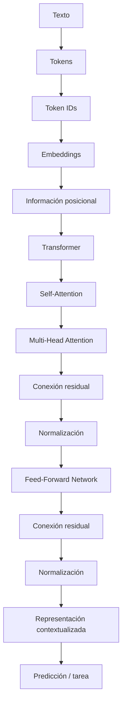
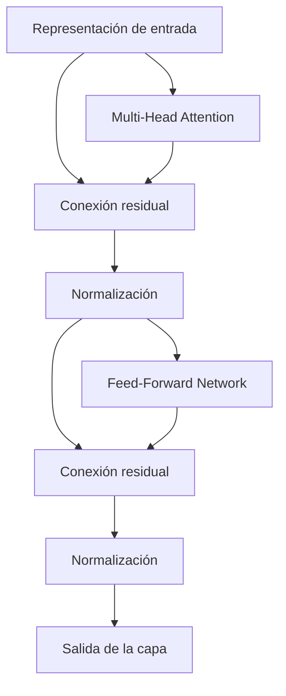
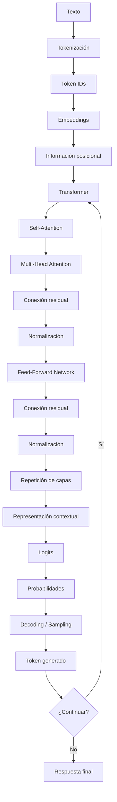
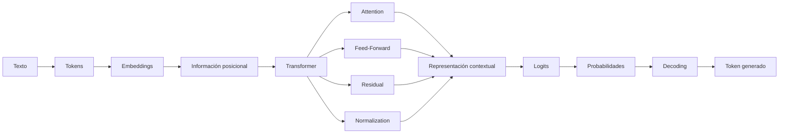

# 04 — Transformer

> **Nivel:** Fundamentos → avanzado → maestría/PhD
> **Área:** Anatomía de un LLM
> **Prerrequisitos:** Tokens, embeddings, contexto y probabilidad
> **Objetivo:** Comprender qué es un Transformer, cómo procesa una secuencia de tokens y por qué esta arquitectura cambió la forma de construir modelos de lenguaje modernos.

---

# 1. ¿Por qué necesitamos un Transformer?

En los capítulos anteriores vimos que un texto puede convertirse en tokens y que cada token puede representarse mediante un vector llamado **embedding**.

Pero aparece una pregunta fundamental:

> **¿Cómo puede un modelo determinar qué relación existe entre los diferentes tokens de una oración?**

Por ejemplo:

> `El banco aprobó el crédito porque el cliente tenía buenos ingresos.`

El modelo necesita relacionar conceptos como:

```text
banco
  ↓
institución financiera

crédito
  ↓
producto financiero

cliente
  ↓
persona que solicita el crédito

ingresos
  ↓
información relevante para aprobar el crédito
```

La representación inicial de los tokens no es suficiente.

El modelo necesita **procesar las relaciones entre los tokens teniendo en cuenta el contexto**.

Ahí entra el Transformer.

---

# 2. Definición sencilla

Un **Transformer** es una arquitectura de redes neuronales diseñada para procesar secuencias utilizando principalmente mecanismos de **atención (attention)**.

Su característica fundamental es que permite que cada token considere la información de otros tokens de la secuencia para construir representaciones contextualizadas.

Una simplificación conceptual sería:

```text
TOKENS
   │
   ▼
EMBEDDINGS
   │
   ▼
INFORMACIÓN POSICIONAL
   │
   ▼
TRANSFORMER
   │
   ├── Atención
   │
   ├── Transformación neuronal
   │
   ├── Conexiones residuales
   │
   └── Normalización
   │
   ▼
REPRESENTACIONES CONTEXTUALIZADAS
   │
   ▼
PREDICCIÓN
```

La idea más importante es:

> **El Transformer transforma representaciones de tokens en representaciones que incorporan contexto y relaciones entre tokens.**

---

# 3. Una analogía: leer una oración

Imagina que cinco personas están sentadas en una mesa:

```text
Ana ─── Luis ─── Pedro ─── María ─── Carlos
```

Cada persona representa un token.

Si preguntamos:

> ¿Quién está relacionado con Pedro?

Pedro puede prestar atención a:

```text
Ana       Luis       Pedro       María       Carlos
 ↓          ↓          ↓           ↓           ↓
0.05      0.15       0.10        0.50        0.20
```

Los valores representan, de manera simplificada, cuánto peso asignaría Pedro a la información de los demás tokens.

El Transformer hace algo parecido mediante el mecanismo de **self-attention**.

Pero hay una diferencia fundamental:

> No existen personas sentadas físicamente en una mesa.

El modelo realiza operaciones matemáticas con vectores.

---

# 4. La arquitectura Transformer

El Transformer fue presentado en 2017 en el trabajo:

> **Attention Is All You Need**

La arquitectura original estaba formada por dos grandes partes:

```text
                 TRANSFORMER ORIGINAL

             ┌───────────────────────┐
             │       ENCODER         │
Entrada ────►│                       │
             └───────────┬───────────┘
                         │
                         ▼
             ┌───────────────────────┐
             │       DECODER         │
             │                       │
             └───────────┬───────────┘
                         │
                         ▼
                      SALIDA
```

Sin embargo, los modelos actuales no necesariamente utilizan exactamente esta arquitectura completa.

Existen diferentes familias:

```text
TRANSFORMERS
     │
     ├── Encoder-only
     │      └── BERT
     │
     ├── Decoder-only
     │      └── GPT y numerosos LLM generativos
     │
     └── Encoder-Decoder
            └── T5 y modelos similares
```

Esta distinción será muy importante cuando estudiemos cómo interactúa un prompt con diferentes arquitecturas.

---

# 5. La idea revolucionaria

Antes de los Transformers existían arquitecturas como:

* RNN
* LSTM
* GRU

Estas arquitecturas procesaban las secuencias de manera predominantemente secuencial.

Conceptualmente:

```text
Token 1
   ↓
Token 2
   ↓
Token 3
   ↓
Token 4
   ↓
Token 5
```

El Transformer cambió el enfoque:

```text
Token 1 ─────┐
Token 2 ─────┤
Token 3 ─────┼──► ATENCIÓN
Token 4 ─────┤
Token 5 ─────┘
```

Cada token puede establecer relaciones con otros tokens mediante atención.

Esto permitió una mayor capacidad para modelar dependencias entre elementos de una secuencia y facilitó el procesamiento paralelo durante el entrenamiento.

---

# 6. El concepto central: Self-Attention

El corazón del Transformer es el mecanismo conocido como:

**Self-Attention**

En español:

**Autoatención**.

La idea es sencilla:

> Cada token calcula qué otros tokens de la misma secuencia son relevantes para interpretarlo.

Por ejemplo:

```text
El gato que estaba sobre la mesa comió pescado.
```

Para interpretar:

```text
comió
```

pueden ser importantes:

```text
gato
pescado
```

Mientras que:

```text
El
que
estaba
sobre
la
```

pueden tener diferente relevancia para esa interpretación concreta.

La atención permite que el modelo aprenda esas relaciones.

---

# 7. Mapa conceptual del Transformer



Este esquema representa una simplificación pedagógica.

Los detalles exactos del orden de normalización y otros componentes dependen de la variante concreta de Transformer.

---

# 8. ¿Qué entra al Transformer?

Supongamos:

```text
El gato duerme
```

Después de tokenizar:

```text
[El] [gato] [duerme]
```

Los tokens se convierten en identificadores:

```text
[125] [8342] [921]
```

Después se obtienen embeddings:

```text
El       → vector
gato     → vector
duerme   → vector
```

Podemos imaginar:

```text
El       → [0.21, -0.13, 0.77, ...]
gato     → [0.62,  0.08, 0.31, ...]
duerme   → [0.14, -0.72, 0.44, ...]
```

Estos vectores todavía necesitan incorporar información sobre:

1. posición;
2. contexto;
3. relaciones con otros tokens.

---

# 9. ¿Cómo sabe el modelo dónde está cada token?

Consideremos:

```text
El gato persigue al perro.
```

El orden importa.

No significa lo mismo:

```text
El gato persigue al perro.
```

que:

```text
El perro persigue al gato.
```

Los mismos conceptos pueden aparecer, pero las relaciones cambian.

Por eso el Transformer necesita información sobre la posición.

Conceptualmente:

```text
Embedding del token
        +
Información de posición
        │
        ▼
Representación de entrada
```

La forma concreta de representar la posición ha evolucionado.

Existen diferentes mecanismos, entre ellos:

* positional encoding;
* positional embeddings;
* RoPE (Rotary Position Embedding);
* ALiBi;
* otras variantes.

No todos los Transformers utilizan el mismo mecanismo.

---

# 10. Una representación matemática simplificada

Podemos representar la entrada como una matriz:

$$
X \in \mathbb{R}^{n \times d}
$$

donde:

* \(n\) = número de tokens;
* \(d\) = dimensión de la representación.

Por ejemplo:

```text
              dimensiones
          d1    d2    d3   ...   dd

Token 1   ────────────────────────
Token 2   ────────────────────────
Token 3   ────────────────────────
...
Token n   ────────────────────────
```

Por tanto:

$$
X =
\begin{bmatrix}
x_1 \\
x_2 \\
x_3 \\
\vdots \\
x_n
\end{bmatrix}
$$

Cada fila representa un token.

---

# 11. El gran mecanismo Q, K y V

Para entender realmente la atención necesitamos introducir tres conceptos:

* **Query (Q)** — consulta;
* **Key (K)** — clave;
* **Value (V)** — valor.

Estos nombres pueden parecer abstractos, así que utilicemos una analogía.

Imagina una biblioteca.

Quieres encontrar información sobre:

> "animales domésticos"

Tu consulta sería:

```text
QUERY
"animales domésticos"
```

La biblioteca tiene diferentes registros:

```text
KEY
animales
historia
programación
economía
medicina
```

El sistema compara tu consulta con las claves.

Cuando encuentra coincidencias relevantes, recupera la información asociada:

```text
VALUE
```

El mecanismo de atención utiliza una idea matemática relacionada con esto.

---

# 12. Q, K y V dentro del Transformer

A partir de la representación de entrada \(X\), se calculan:

$$
Q = XW_Q
$$

$$
K = XW_K
$$

$$
V = XW_V
$$

donde:

* \(W_Q\) = matriz aprendida para generar Queries;
* \(W_K\) = matriz aprendida para generar Keys;
* \(W_V\) = matriz aprendida para generar Values.

Estas matrices forman parte de los parámetros aprendidos del modelo.

---

# 13. ¿Qué significa realmente Q, K y V?

Podemos visualizarlo así:

```text
                X
                │
       ┌────────┼────────┐
       ▼        ▼        ▼
      WQ       WK       WV
       │        │        │
       ▼        ▼        ▼
       Q        K        V
       │        │        │
       └────┬───┘        │
            ▼            │
       Compatibilidad    │
            │            │
            ▼            │
       Pesos atención    │
            │            │
            └──────┬─────┘
                   ▼
              Información
             contextual
```

Una forma intuitiva de recordarlo:

```text
Q = ¿Qué estoy buscando?

K = ¿Qué información represento?

V = ¿Qué información entregaré si soy relevante?
```

No debemos interpretar estas preguntas literalmente como si el modelo tuviera una conciencia o un buscador interno.

Son una analogía para entender las operaciones matemáticas.

---

# 14. ¿Cómo se calcula la atención?

La fórmula clásica de scaled dot-product attention es:

$$
Attention(Q,K,V)
=
softmax
\left(
\frac{QK^T}{\sqrt{d_k}}
\right)V
$$

Esta ecuación contiene varias etapas.

---

# 15. Paso 1 — Comparar Q con K

Primero:

$$
QK^T
$$

Esto produce puntuaciones de compatibilidad.

Conceptualmente:

```text
           K1     K2     K3     K4

Q1        0.2    1.8    0.4    0.1
Q2        1.1    0.3    2.4    0.5
Q3        0.2    0.4    0.8    2.1
```

Los valores más altos indican mayor compatibilidad según la representación aprendida.

---

# 16. Paso 2 — Escalamiento

Se divide por:

$$
\sqrt{d_k}
$$

Por tanto:

$$
\frac{QK^T}{\sqrt{d_k}}
$$

¿Por qué?

Porque cuando las dimensiones son grandes, los productos escalares pueden crecer considerablemente.

Eso puede hacer que el `softmax` produzca distribuciones demasiado extremas.

El escalamiento ayuda a mantener una escala numérica más estable.

---

# 17. Paso 3 — Softmax

Después:

$$
softmax
\left(
\frac{QK^T}{\sqrt{d_k}}
\right)
$$

convierte las puntuaciones en pesos que suman aproximadamente 1 por fila.

Ejemplo conceptual:

```text
Token actual:

gato

Atención:

El       → 0.05
gato     → 0.20
duerme   → 0.60
rápido   → 0.15
```

La interpretación simplificada sería:

> Para construir la representación contextual de `gato`, el modelo está asignando diferentes pesos a los tokens disponibles.

Pero estos pesos no deben interpretarse automáticamente como una explicación completa del razonamiento del modelo.

---

# 18. Paso 4 — Combinar los Values

Finalmente:

$$
Attention(Q,K,V) = A V
$$

donde:

$$
A =
softmax
\left(
\frac{QK^T}{\sqrt{d_k}}
\right)
$$

Los pesos de atención se utilizan para combinar los valores.

Conceptualmente:

```text
               Valores
                  │
                  ▼
        ┌───────────────────┐
        │ Pesos de atención │
        └─────────┬─────────┘
                  │
                  ▼
          combinación de
            información
                  │
                  ▼
       representación contextual
```

---

# 19. Ejemplo completo de atención

Consideremos:

> `El perro persigue al gato.`

El modelo procesa los tokens:

```text
El | perro | persigue | al | gato
```

Para construir la representación contextual de:

```text
persigue
```

puede aprender relaciones con:

```text
perro
gato
```

Una representación simplificada podría ser:

```text
El         0.03
perro      0.38
persigue   0.12
al         0.04
gato       0.43
```

No significa que estos sean los valores reales de un modelo.

Es únicamente una representación didáctica.

La idea es:

```text
"persigue"
      │
      ├────────► "perro"
      │
      └────────► "gato"
```

El Transformer puede construir una representación de `persigue` influenciada por esas relaciones.

---

# 20. La atención no es una sola relación

Una de las grandes ideas del Transformer es **Multi-Head Attention**.

En lugar de tener un único mecanismo de atención:

```text
Entrada
   │
   ▼
Atención
   │
   ▼
Salida
```

se utilizan múltiples cabezas:

```text
                 Entrada
                    │
       ┌────────────┼────────────┐
       ▼            ▼            ▼
    Head 1        Head 2       Head 3
       │            │            │
       ▼            ▼            ▼
    relación     relación     relación
       │            │            │
       └────────────┼────────────┘
                    ▼
                 combinación
                    │
                    ▼
                  salida
```

Cada cabeza tiene sus propios parámetros de proyección y puede aprender diferentes patrones de interacción.

---

# 21. ¿Qué puede aprender una cabeza?

En un modelo real no debemos afirmar que cada cabeza tiene una función humana fija.

Sin embargo, durante el análisis de modelos se pueden observar patrones donde ciertas cabezas parecen capturar relaciones como:

* relaciones sintácticas;
* referencias entre palabras;
* relaciones entre posiciones;
* dependencias de largo alcance;
* patrones lingüísticos;
* estructuras específicas de una tarea.

Por ejemplo:

```text
María llevó el libro porque ella tenía una reunión.
                             │
                             └──► "ella"
```

Una cabeza podría aprender patrones relacionados con referencias.

Pero:

> **No debemos asumir que una cabeza corresponde siempre a una regla lingüística única y estable.**

La interpretación de mecanismos internos es un área activa de investigación.

---

# 22. ¿Por qué múltiples cabezas?

Podemos imaginar diferentes perspectivas:

```text
              MISMA ORACIÓN
                    │
       ┌────────────┼────────────┐
       ▼            ▼            ▼
   Cabeza A      Cabeza B      Cabeza C
       │            │            │
   sintaxis      posición      semántica
       │            │            │
       └────────────┼────────────┘
                    ▼
             representación
```

Esta es una simplificación pedagógica.

En la práctica, las funciones aprendidas por las cabezas pueden solaparse y ser mucho más complejas.

---

# 23. ¿Qué ocurre después de la atención?

La atención no constituye todo el Transformer.

Una capa típica contiene además una **Feed-Forward Network (FFN)**.

Conceptualmente:

```text
Entrada
   │
   ▼
Multi-Head Attention
   │
   ▼
Conexión residual
   │
   ▼
Normalización
   │
   ▼
Feed-Forward Network
   │
   ▼
Conexión residual
   │
   ▼
Normalización
   │
   ▼
Salida
```

Dependiendo de la arquitectura concreta, el orden exacto de normalización puede cambiar.

---

# 24. Feed-Forward Network

La red feed-forward aplica transformaciones no lineales a cada posición.

Una forma simplificada:

$$
FFN(x) = W_2 \sigma(W_1x+b_1)+b_2
$$

donde:

* \(W_1\) y \(W_2\) son matrices de parámetros;
* \(b_1\) y \(b_2\) son términos de sesgo;
* \(\sigma\) es una función de activación.

En Transformers modernos se utilizan diferentes variantes de activación y estructuras FFN.

Su función conceptual es:

> transformar y enriquecer la representación que recibió información contextual mediante la atención.

---

# 25. Conexiones residuales

Las conexiones residuales permiten que una capa conserve información de su entrada.

Conceptualmente:

```text
             ┌──────────────────────┐
             │                      │
             │      Entrada         │
             │         │            │
             │         ▼            │
             │      Atención        │
             │         │            │
             └─────────┼────────────┘
                       ▼
                     SUMA
                       │
                       ▼
                    Salida
```

Matemáticamente:

$$
y = x + F(x)
$$

donde:

* \(x\) es la entrada;
* \(F(x)\) es la transformación;
* \(y\) es el resultado.

Esto facilita la optimización de redes profundas y ayuda al flujo de información y gradientes.

---

# 26. Normalización

Los Transformers también utilizan mecanismos de normalización.

Su objetivo general es ayudar a mantener las representaciones en escalas adecuadas durante el procesamiento.

Una arquitectura puede utilizar variantes como:

* LayerNorm;
* RMSNorm;
* otras modificaciones.

Esto es importante porque un Transformer puede tener muchas capas.

Por ejemplo:

```text
Capa 1
  ↓
Capa 2
  ↓
Capa 3
  ↓
...
  ↓
Capa 50
  ↓
Capa 100
  ↓
Capa N
```

Sin mecanismos adecuados de estabilización, entrenar redes profundas sería mucho más difícil.

---

# 27. Una capa Transformer completa

Podemos resumirla así:



Esta estructura se repite muchas veces.

---

# 28. ¿Un Transformer es una sola capa?

No.

Un LLM moderno normalmente contiene muchas capas Transformer.

Conceptualmente:

```text
Entrada
   │
   ▼
┌──────────────┐
│ Transformer  │  Capa 1
└──────┬───────┘
       ▼
┌──────────────┐
│ Transformer  │  Capa 2
└──────┬───────┘
       ▼
┌──────────────┐
│ Transformer  │  Capa 3
└──────┬───────┘
       ▼
      ...
       ▼
┌──────────────┐
│ Transformer  │  Capa N
└──────┬───────┘
       ▼
Representación final
```

Cada capa transforma las representaciones producidas por la anterior.

---

# 29. Del token a la representación contextual

Podemos observar el proceso completo:

```text
"banco"
   │
   ▼
Token ID
   │
   ▼
Embedding
   │
   ▼
Información posicional
   │
   ▼
Capa Transformer
   │
   ▼
Atención con otros tokens
   │
   ▼
Transformación FFN
   │
   ▼
Capa Transformer
   │
   ▼
...
   │
   ▼
Representación contextualizada
```

La representación inicial de `banco` no es necesariamente la representación final utilizada para producir una respuesta.

---

# 30. Ejemplo: la palabra "banco"

Comparemos:

### Oración A

> `Me senté en el banco del parque.`

### Oración B

> `El banco aprobó mi préstamo.`

La palabra:

```text
banco
```

aparece en ambas.

Pero el contexto cambia completamente.

```text
BANCO
 │
 ├── parque
 │     ↓
 │   asiento
 │
 └── préstamo
       ↓
   institución financiera
```

El Transformer permite que la representación de un token sea modificada mediante su interacción con el contexto.

Por eso hablamos de:

> **representaciones contextualizadas.**

---

# 31. El Transformer como constructor de contexto

Podemos simplificar todo el proceso como:

```text
Token
  │
  ▼
Representación inicial
  │
  ▼
Interacción con otros tokens
  │
  ▼
Relaciones
  │
  ▼
Transformaciones
  │
  ▼
Nueva representación
  │
  ▼
Más capas
  │
  ▼
Representación altamente contextualizada
```

Esto conecta directamente con el capítulo anterior sobre embeddings.

---

# 32. Encoder, Decoder y Encoder-Decoder

No todos los Transformers funcionan de la misma manera.

Existen tres familias conceptuales importantes.

---

## 32.1 Encoder-only

Ejemplo clásico:

**BERT**

```text
Texto
  │
  ▼
Encoder
  │
  ▼
Representaciones
  │
  ├── clasificación
  ├── búsqueda
  ├── extracción
  └── otras tareas
```

Están especialmente orientados a construir representaciones útiles de una entrada.

---

## 32.2 Decoder-only

Muchos LLM generativos modernos utilizan arquitecturas de tipo decoder-only.

Conceptualmente:

```text
Prompt
  │
  ▼
Tokens
  │
  ▼
Transformer Decoder
  │
  ▼
Probabilidades
  │
  ▼
Siguiente token
  │
  ▼
Nuevo contexto
  │
  ▼
Siguiente token
  │
  ▼
...
```

Este mecanismo es especialmente importante para entender modelos autoregresivos.

---

## 32.3 Encoder-Decoder

Tenemos:

```text
Entrada
   │
   ▼
Encoder
   │
   ▼
Representación
   │
   ▼
Decoder
   │
   ▼
Salida
```

Fue especialmente importante en tareas como:

* traducción;
* transformación de texto;
* generación condicionada.

---

# 33. Causal Attention

En modelos autoregresivos decoder-only aparece una restricción fundamental.

Si queremos predecir:

> `El gato`

para generar el siguiente token, el modelo no debería utilizar información futura que todavía no existe en la secuencia generada.

Por ejemplo:

```text
El gato duerme tranquilamente
```

Cuando se predice:

```text
duerme
```

el modelo puede utilizar:

```text
El
gato
```

pero no debería utilizar:

```text
tranquilamente
```

porque pertenece al futuro de esa posición.

---

# 34. Máscara causal

Esto se implementa mediante una máscara.

Conceptualmente:

```text
             Tokens visibles

          El  gato  duerme  hoy

El        ✓    ✗      ✗      ✗
gato      ✓    ✓      ✗      ✗
duerme    ✓    ✓      ✓      ✗
hoy       ✓    ✓      ✓      ✓
```

La matriz puede representarse como:

$$
M =
\begin{bmatrix}
1 & 0 & 0 & 0\\
1 & 1 & 0 & 0\\
1 & 1 & 1 & 0\\
1 & 1 & 1 & 1
\end{bmatrix}
$$

Los valores exactos utilizados durante la implementación pueden expresarse de diferentes maneras, pero la idea es impedir que una posición atienda a posiciones futuras.

---

# 35. ¿Cómo genera texto un Transformer?

Supongamos que proporcionamos:

> `La capital de Ecuador es`

El modelo procesa el contexto y obtiene una distribución de probabilidad sobre posibles siguientes tokens.

Conceptualmente:

```text
La capital de Ecuador es
             │
             ▼
        Transformer
             │
             ▼
      distribución
             │
       ┌─────┼─────┐
       ▼     ▼     ▼
     Quito  Lima  Bogotá
      0.72  0.05   0.03
```

El modelo selecciona un token según el mecanismo de decodificación utilizado.

Después:

```text
La capital de Ecuador es Quito
```

y vuelve a realizar el proceso.

---

# 36. El Transformer no "escribe una respuesta completa"

Una simplificación común es imaginar:

```text
Prompt
  ↓
Respuesta completa
```

Conceptualmente, en un modelo autoregresivo se parece más a:

```text
Prompt
  ↓
Token siguiente
  ↓
Contexto actualizado
  ↓
Token siguiente
  ↓
Contexto actualizado
  ↓
Token siguiente
  ↓
...
```

Por ejemplo:

```text
Entrada:
"El cielo es"

↓
"azul"

↓
"durante"

↓
"el"

↓
"día"

↓
...
```

Cada nuevo token pasa a formar parte del contexto disponible para los siguientes pasos.

---

# 37. ¿Dónde entra el prompt?

Aquí aparece uno de los conceptos centrales de este repositorio.

El prompt no se introduce directamente en una "caja de texto inteligente".

El proceso conceptual es:

```text
PROMPT
   │
   ▼
Tokenización
   │
   ▼
Token IDs
   │
   ▼
Embeddings
   │
   ▼
Información posicional
   │
   ▼
Transformer
   │
   ▼
Atención
   │
   ▼
Transformaciones
   │
   ▼
Distribución de probabilidades
   │
   ▼
Sampling / Decoding
   │
   ▼
TOKEN GENERADO
```

Por eso:

> **Cambiar el prompt cambia los tokens y el contexto que procesa el modelo.**

Y eso puede cambiar completamente la trayectoria de generación.

---

# 38. El prompt no controla directamente los parámetros

Un error frecuente es pensar:

> "Si escribo una instrucción muy específica, cambio los parámetros del modelo."

No.

Los parámetros del modelo fueron aprendidos durante el entrenamiento y normalmente permanecen fijos durante la inferencia.

El prompt modifica principalmente:

* la entrada;
* el contexto;
* las activaciones producidas por esa entrada;
* las condiciones bajo las cuales el modelo realiza la predicción.

Conceptualmente:

```text
                 MODELO
        ┌────────────────────┐
        │                    │
        │    Parámetros      │
        │    aprendidos      │
        │                    │
        └─────────┬──────────┘
                  │
                  │
PROMPT ─────────► INFERENCIA
                  │
                  ▼
               SALIDA
```

El prompt condiciona la ejecución del modelo; no reentrena el modelo.

---

# 39. Prompt y arquitectura

Aquí aparece una idea fundamental para la Ingeniería de Prompt:

> **No existe un prompt universalmente óptimo para todas las arquitecturas.**

Por ejemplo:

```text
                 PROMPT
                    │
          ┌─────────┼──────────┐
          ▼         ▼          ▼
      Encoder    Decoder    Encoder-Decoder
          │         │          │
          ▼         ▼          ▼
       contexto  generación  transformación
```

La forma de diseñar instrucciones debe considerar cómo procesa información la arquitectura.

---

# 40. Ejemplo conceptual

Supongamos que queremos:

> resumir un documento.

En un sistema encoder-oriented:

```text
Documento
   ↓
Representación
   ↓
Tarea de resumen
```

En un sistema decoder-only:

```text
Prompt:
"Resume el siguiente documento..."

Documento
   ↓
Contexto
   ↓
Predicción autoregresiva
   ↓
Resumen
```

En un encoder-decoder:

```text
Documento
   ↓
Encoder
   ↓
Representación
   ↓
Decoder
   ↓
Resumen
```

La tarea puede parecer igual desde el exterior.

Internamente, no necesariamente funciona igual.

---

# 41. El Transformer y el contexto

El contexto es fundamental porque la atención opera sobre las representaciones disponibles dentro de una determinada secuencia o ventana de contexto.

Podemos imaginar:

```text
┌─────────────────────────────────────────┐
│              CONTEXTO                   │
│                                         │
│ instrucciones                           │
│ información del usuario                 │
│ documentos                              │
│ conversación                            │
│ herramientas / resultados               │
│                                         │
└──────────────────┬──────────────────────┘
                   │
                   ▼
              TRANSFORMER
                   │
                   ▼
              PREDICCIÓN
```

Por eso el **context engineering** será una evolución natural de la Ingeniería de Prompt.

---

# 42. Atención y documentos largos

Supongamos un contexto:

```text
Documento
│
├── Página 1
├── Página 2
├── Página 3
├── ...
├── Página 100
└── Página 101
```

El modelo no necesariamente trata todos los elementos de la misma forma.

La relevancia depende de:

* contenido;
* posición;
* patrones aprendidos;
* arquitectura;
* mecanismo de atención;
* instrucciones;
* contexto completo;
* estrategia de inferencia.

Esto explica por qué:

> aumentar el contexto disponible no garantiza automáticamente una mejor respuesta.

---

# 43. Complejidad computacional de la atención

La atención estándar calcula interacciones entre posiciones.

Para una secuencia de longitud \(n\), la matriz:

$$
QK^T
$$

tiene una dimensión relacionada con:

$$
n \times n
$$

Por ello, la atención estándar tiene un coste que crece aproximadamente de forma cuadrática respecto a la longitud de la secuencia en esa parte del cálculo.

Conceptualmente:

```text
Tokens
  │
  ▼
n
  │
  ▼
Interacciones
  │
  ▼
n × n
```

Si duplicamos la longitud:

```text
n       → n²
2n      → 4n²
```

Esto es una de las razones por las que la eficiencia de la atención es un área importante de investigación.

---

# 44. ¿Cómo se solucionan estos problemas?

La investigación ha producido múltiples estrategias y arquitecturas.

Entre ellas:

* atención eficiente;
* kernels optimizados;
* FlashAttention;
* atención agrupada;
* atención con múltiples consultas;
* mecanismos de posición más eficientes;
* arquitecturas híbridas;
* modelos con estados recurrentes o mecanismos alternativos;
* técnicas de compresión y gestión del contexto.

No todos los modelos modernos dependen exactamente del mismo mecanismo.

Por eso:

> aprender "Transformer" no significa memorizar una única implementación.

Significa comprender el conjunto de principios arquitectónicos y saber identificar las variantes.

---

# 45. Transformer clásico vs modelos modernos

Es importante evitar una simplificación:

> "Todos los LLM actuales son exactamente el Transformer de 2017."

No.

El Transformer original es el punto de partida de una enorme familia de arquitecturas.

Los modelos modernos pueden incorporar modificaciones en:

* normalización;
* atención;
* codificación posicional;
* FFN;
* activaciones;
* conexiones residuales;
* tokenización;
* arquitectura de salida;
* gestión del contexto;
* eficiencia computacional;
* entrenamiento;
* inferencia.

Por eso debemos distinguir:

```text
TRANSFORMER
     │
     ├── concepto arquitectónico
     │
     └── múltiples implementaciones
             │
             ├── BERT
             ├── T5
             ├── GPT
             └── otras familias
```

---

# 46. Mapa conceptual general



---

# 47. El flujo completo de un LLM decoder-only

Podemos resumirlo en una cadena:

```text
                 USUARIO
                    │
                    ▼
                  PROMPT
                    │
                    ▼
               TOKENIZACIÓN
                    │
                    ▼
                TOKEN IDs
                    │
                    ▼
                EMBEDDINGS
                    │
                    ▼
            INFORMACIÓN POSICIONAL
                    │
                    ▼
          ┌──────────────────────┐
          │      TRANSFORMER     │
          │                      │
          │  Atención            │
          │  FFN                 │
          │  Residual            │
          │  Normalización       │
          │                      │
          └──────────┬───────────┘
                     │
                     ▼
                   LOGITS
                     │
                     ▼
                PROBABILIDADES
                     │
                     ▼
               DECODIFICACIÓN
                     │
                     ▼
              SIGUIENTE TOKEN
                     │
                     └──────► CONTEXTO
                                  │
                                  ▼
                              REPETICIÓN
```

---

# 48. ¿Dónde están los parámetros?

Los parámetros aparecen en diferentes componentes.

Por ejemplo:

```text
MODELO
 │
 ├── Embedding
 │
 ├── WQ
 │
 ├── WK
 │
 ├── WV
 │
 ├── Proyecciones de atención
 │
 ├── Feed-Forward
 │
 ├── Normalización
 │
 └── Capa de salida
```

Durante el entrenamiento, estos parámetros se ajustan utilizando grandes cantidades de datos.

Durante la inferencia:

```text
Parámetros
    │
    ▼
Modelo aprendido
    │
    +
Prompt
    │
    ▼
Predicción
```

El prompt no sustituye los parámetros.

---

# 49. Una distinción fundamental

Debemos separar tres conceptos:

### Parámetros

Lo que el modelo aprendió.

### Contexto

La información que recibe durante una ejecución concreta.

### Prompt

Una parte estructurada del contexto utilizada para comunicar instrucciones, información, ejemplos o restricciones.

Podemos representarlo así:

```text
               MODELO
          ┌───────────────┐
          │  PARÁMETROS   │
          │   aprendidos  │
          └───────┬───────┘
                  │
                  ▼
             INFERENCIA
                  ▲
                  │
          ┌───────┴───────┐
          │    CONTEXTO   │
          │               │
          │  ┌─────────┐  │
          │  │ PROMPT  │  │
          │  └─────────┘  │
          │  documentos   │
          │  conversación  │
          │  herramientas  │
          └───────────────┘
```

Esta separación será esencial para comprender posteriormente:

* prompting;
* RAG;
* fine-tuning;
* memory;
* context engineering;
* agentes.

---

# 50. ¿Por qué el Transformer importa para la Ingeniería de Prompt?

Porque el prompt no se interpreta como una instrucción mágica.

Se convierte en datos que atraviesan una arquitectura.

Podemos visualizarlo así:

```text
                    PROMPT
                       │
                       ▼
                  TOKENIZACIÓN
                       │
                       ▼
                   EMBEDDING
                       │
                       ▼
                REPRESENTACIÓN
                       │
                       ▼
              ┌─────────────────┐
              │   TRANSFORMER   │
              │                 │
              │    Atención     │
              │       ↓         │
              │      FFN        │
              │       ↓         │
              │   más capas     │
              └────────┬────────┘
                       │
                       ▼
                 DISTRIBUCIÓN
                 DE PROBABILIDAD
                       │
                       ▼
                   GENERACIÓN
```

Por eso cambiar:

```text
"Resume este texto."
```

por:

```text
"Resume este texto en cinco puntos, identifica los riesgos y separa hechos de opiniones."
```

cambia la entrada y las condiciones de inferencia.

El modelo puede producir una distribución diferente de posibles continuaciones.

---

# 51. ¿Por qué pequeños cambios en el prompt pueden producir grandes diferencias?

Porque una modificación textual puede alterar:

1. los tokens;
2. sus representaciones;
3. las relaciones calculadas mediante atención;
4. las activaciones de las capas;
5. los logits;
6. la distribución de probabilidades;
7. los tokens generados;
8. y, posteriormente, el contexto disponible para los siguientes tokens.

Podemos representarlo como:

```text
Cambio pequeño en prompt
          │
          ▼
Cambio en tokens
          │
          ▼
Cambio en representaciones
          │
          ▼
Cambio en activaciones
          │
          ▼
Cambio en logits
          │
          ▼
Cambio en probabilidades
          │
          ▼
Cambio en token generado
          │
          ▼
Nuevo contexto
          │
          ▼
Nuevas probabilidades
```

Este efecto acumulativo es especialmente importante en generación autoregresiva.

---

# 52. Un ejemplo de Ingeniería de Prompt

Prompt A:

```text
Explica qué es un Transformer.
```

Prompt B:

```text
Explica qué es un Transformer para un estudiante
que conoce Python pero no redes neuronales.

Primero utiliza una analogía.
Después explica self-attention.
Después introduce Q, K y V.
Finalmente muestra la ecuación de atención.
No omitas las limitaciones.
```

El segundo prompt proporciona:

* audiencia;
* estructura;
* orden;
* restricciones;
* profundidad esperada.

No modifica los parámetros internos del modelo.

Modifica las condiciones bajo las cuales el modelo genera la respuesta.

---

# 53. El Transformer no "entiende" como una persona

Es importante utilizar correctamente el lenguaje.

Podemos decir:

> "El modelo representa una relación entre tokens."

Es mejor evitar afirmar sin matices:

> "El modelo comprende exactamente lo que piensa el usuario."

El Transformer realiza operaciones matemáticas aprendidas a partir de datos.

La palabra **comprensión** puede utilizarse como abreviatura pedagógica, pero no debe confundirse automáticamente con comprensión humana.

---

# 54. Transformer y conocimiento

Otro error frecuente:

> "El Transformer consulta una base de datos interna cada vez que responde."

No necesariamente.

El conocimiento aprendido durante el entrenamiento está distribuido en los parámetros y representaciones del modelo.

Durante la inferencia, el modelo procesa el contexto proporcionado y produce predicciones.

Cuando existe RAG, herramientas o sistemas externos, el flujo cambia:

```text
Prompt
  │
  ▼
Sistema
  │
  ├── LLM
  │
  ├── Base de datos
  │
  ├── Buscador
  │
  └── Herramientas
```

Eso será estudiado posteriormente como **sistema de IA**, no simplemente como "el modelo".

---

# 55. Transformer + RAG

En un sistema RAG podemos tener:

```text
                 USUARIO
                    │
                    ▼
                  QUERY
                    │
                    ▼
              RECUPERACIÓN
                    │
             ┌──────┴──────┐
             ▼             ▼
        documentos       metadatos
             │
             ▼
           CONTEXTO
             │
             ▼
            LLM
             │
             ▼
        TRANSFORMER
             │
             ▼
          RESPUESTA
```

Aquí el Transformer no necesariamente contiene toda la información específica de los documentos.

El sistema le proporciona información adicional como contexto.

Esta diferencia será fundamental cuando estudiemos **RAG y Context Engineering**.

---

# 56. Transformer y agentes

En un agente moderno:

```text
Usuario
   │
   ▼
Agente
   │
   ├── Modelo
   ├── Herramientas
   ├── Memoria
   ├── Contexto
   └── Estado
          │
          ▼
       Acción
          │
          ▼
      Resultado
          │
          ▼
      Nuevo contexto
```

El Transformer sigue siendo parte del modelo, pero el sistema completo es mucho más grande.

Por eso:

> **Un LLM no es lo mismo que un agente.**

Un agente puede utilizar un LLM como componente de decisión o generación dentro de un sistema más amplio.

---

# 57. Errores conceptuales frecuentes

## Error 1

> "Transformer = ChatGPT."

Incorrecto.

ChatGPT es un producto/sistema que puede utilizar diferentes modelos y componentes.

Transformer es una arquitectura.

---

## Error 2

> "Todos los Transformers son iguales."

Incorrecto.

Existen numerosas variantes arquitectónicas.

---

## Error 3

> "Attention significa que el modelo sabe qué es importante de forma consciente."

Incorrecto.

Attention es un mecanismo matemático que calcula ponderaciones entre representaciones.

---

## Error 4

> "Cada cabeza representa exactamente una característica."

No necesariamente.

Las cabezas pueden aprender patrones complejos, distribuidos y parcialmente superpuestos.

---

## Error 5

> "El prompt cambia los parámetros."

Normalmente no.

El prompt cambia la entrada y las condiciones de inferencia.

---

## Error 6

> "Más contexto siempre significa mejor respuesta."

No necesariamente.

El rendimiento depende de la arquitectura, entrenamiento, posición, relevancia, calidad del contexto y estrategia de inferencia, entre otros factores.

---

## Error 7

> "El modelo genera toda la respuesta de una sola vez."

En modelos autoregresivos, normalmente la generación ocurre token a token.

---

# 58. Mapa mental para recordar el Transformer

```text
                         TRANSFORMER
                              │
          ┌───────────────────┼───────────────────┐
          │                   │                   │
       ENTRADA             ATENCIÓN            SALIDA
          │                   │                   │
       Tokens                 │                Logits
          │                   │                   │
     Embeddings               │             Probabilidades
          │                   │                   │
     Posición                 │               Decoding
                              │                   │
                    ┌─────────┼─────────┐         │
                    │         │         │         │
                    Q         K         V         │
                    │         │         │         │
                    └────┬────┴────┬────┘         │
                         │         │              │
                    compatibilidad │              │
                         │         │              │
                         └────┬────┘              │
                              ▼                   │
                         Softmax                 │
                              │                   │
                              ▼                   │
                        combinación              │
                              │                   │
                              └──────────┬────────┘
                                         ▼
                                  TOKEN GENERADO
```

---

# 59. Nivel avanzado: una capa como transformación de representaciones

Desde una perspectiva más matemática, podemos pensar en una capa Transformer como una transformación:

$$
X^{(l)}
\rightarrow
X^{(l+1)}
$$

donde \(l\) representa la profundidad de la capa.

Una simplificación sería:

$$
X^{(l+1)}
=
TransformerLayer(X^{(l)})
$$

Después de múltiples capas:

$$
X^{(0)}
\rightarrow
X^{(1)}
\rightarrow
X^{(2)}
\rightarrow
...
\rightarrow
X^{(L)}
$$

La representación final:

$$
X^{(L)}
$$

contiene información transformada a través de muchas etapas.

---

# 60. Nivel avanzado: atención como operador sobre una secuencia

La atención puede entenderse como un operador que permite mezclar información entre posiciones.

Tenemos:

$$
X \in \mathbb{R}^{n\times d}
$$

y calculamos:

$$
Q=XW_Q
$$

$$
K=XW_K
$$

$$
V=XW_V
$$

Después:

$$
A=
softmax
\left(
\frac{QK^T}{\sqrt{d_k}}
\right)
$$

y:

$$
Y=AV
$$

Así:

$$
X \rightarrow Q,K,V \rightarrow A \rightarrow Y
$$

La matriz \(A\) representa las ponderaciones utilizadas para combinar información entre posiciones.

---

# 61. Nivel maestría/PhD: preguntas que surgen

Una vez comprendida la arquitectura básica, aparecen preguntas de investigación mucho más profundas:

### ¿Qué información codifican realmente las capas?

Esto se estudia mediante:

* mechanistic interpretability;
* probing;
* activation analysis;
* circuit analysis.

### ¿Por qué algunas cabezas desarrollan determinados patrones?

Se investigan:

* attention patterns;
* circuits;
* feature representations;
* superposition;
* sparse features.

### ¿Cómo afecta la profundidad?

Se estudia cómo evolucionan las representaciones a través de las capas.

### ¿Cómo escala el rendimiento?

Se estudian relaciones entre:

* parámetros;
* datos;
* cómputo;
* arquitectura;
* calidad de entrenamiento.

### ¿Qué ocurre con contextos extremadamente largos?

Se investigan:

* eficiencia de atención;
* memoria;
* positional representations;
* long-context evaluation;
* retrieval behavior.

Estas preguntas pertenecen a niveles superiores de investigación y no deben confundirse con la explicación básica del Transformer.

---

# 62. El punto más importante para Ingeniería de Prompt

Después de estudiar este capítulo, debemos abandonar una idea:

> "Prompt engineering consiste solamente en escribir mejores instrucciones."

La visión más avanzada es:

```text
                 INGENIERÍA DE PROMPT
                          │
          ┌───────────────┼────────────────┐
          │               │                │
       MODELO          CONTEXTO         OBJETIVO
          │               │                │
    arquitectura      información       tarea
    entrenamiento     posición          restricciones
    capacidad         estructura        formato
          │               │                │
          └───────────────┼────────────────┘
                          ▼
                       PROMPT
                          │
                          ▼
                      INFERENCIA
                          │
                          ▼
                       SALIDA
                          │
                          ▼
                     EVALUACIÓN
```

El prompt es solo una parte del sistema.

---

# 63. Resumen visual

```text
┌───────────────────────────────────────────────────┐
│                    TRANSFORMER                    │
├───────────────────────────────────────────────────┤
│                                                   │
│  1. Recibe representaciones de tokens             │
│                      ↓                            │
│  2. Incorpora información posicional               │
│                      ↓                            │
│  3. Calcula atención                               │
│                      ↓                            │
│  4. Combina información mediante Q, K y V         │
│                      ↓                            │
│  5. Aplica transformaciones FFN                    │
│                      ↓                            │
│  6. Utiliza conexiones residuales                 │
│                      ↓                            │
│  7. Utiliza normalización                          │
│                      ↓                            │
│  8. Repite el proceso en múltiples capas           │
│                      ↓                            │
│  9. Produce representaciones contextualizadas      │
│                      ↓                            │
│ 10. Genera logits / salida                         │
│                                                   │
└───────────────────────────────────────────────────┘
```

---

# 64. Lo que debes recordar

Si solo recuerdas diez cosas de este capítulo, recuerda estas:

1. **Transformer es una arquitectura de redes neuronales.**

2. **Su mecanismo central es la atención.**

3. **Self-attention permite relacionar diferentes tokens de una secuencia.**

4. **Q, K y V son proyecciones aprendidas utilizadas para calcular atención.**

5. **Multi-Head Attention permite aprender diferentes patrones de interacción.**

6. **Las capas también utilizan transformaciones feed-forward, conexiones residuales y normalización.**

7. **Los Transformers pueden utilizar diferentes estrategias para representar la posición.**

8. **Los modelos decoder-only autoregresivos generan tokens de manera secuencial y utilizan atención causal.**

9. **El prompt condiciona la inferencia, pero normalmente no modifica los parámetros aprendidos del modelo.**

10. **Comprender el Transformer permite entender por qué el diseño del prompt, el contexto y la arquitectura están profundamente relacionados.**

---

# 65. Conexión con los siguientes capítulos

Hasta ahora hemos construido:

```text
TOKENS
   ↓
EMBEDDINGS
   ↓
TRANSFORMER
```

Pero todavía falta comprender en profundidad **cómo funciona exactamente la atención**.

Por eso el siguiente capítulo será:

```text
05-Attention.md
```

Allí profundizaremos en:

* Self-Attention;
* Q, K y V;
* Scaled Dot-Product Attention;
* matrices de atención;
* causal attention;
* máscaras;
* Multi-Head Attention;
* intuición geométrica;
* interpretación de los pesos;
* limitaciones;
* eficiencia;
* relación entre atención y prompt.

La pregunta central será:

> **¿Cómo calcula matemáticamente un Transformer qué información de otros tokens debe utilizar para construir cada representación?**

---

## Mapa general de lo aprendido



> **Idea central:**
> El Transformer no debe imaginarse como una caja que "lee" un texto de manera humana. Es una arquitectura matemática que transforma representaciones mediante múltiples capas de atención y transformaciones neuronales. Esa transformación permite modelar relaciones contextuales complejas y constituye la base de gran parte de los LLM modernos.
