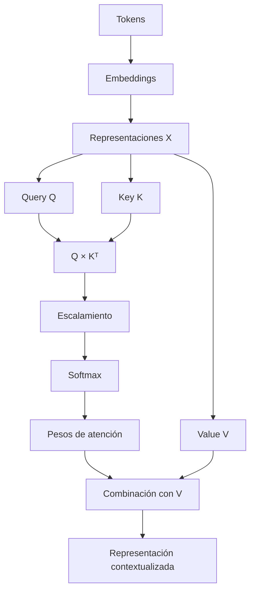
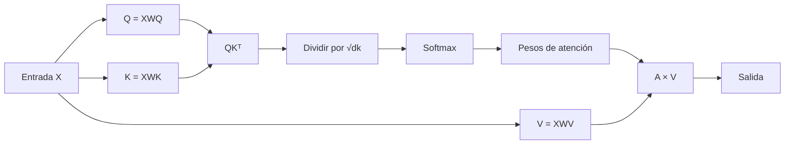
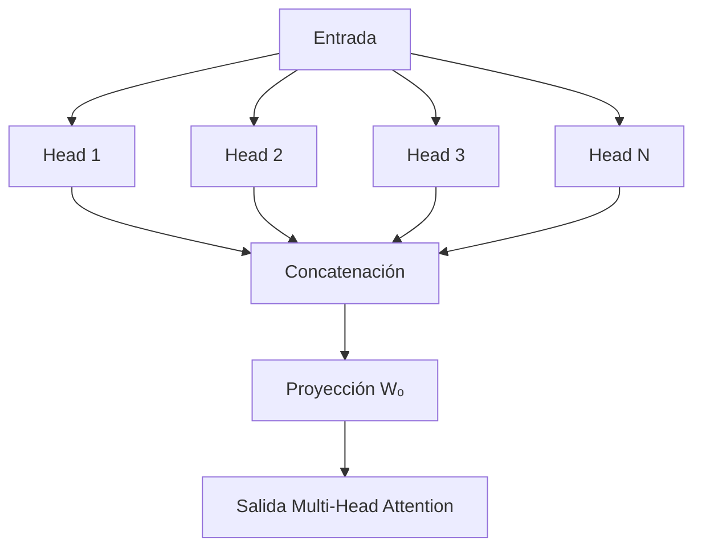
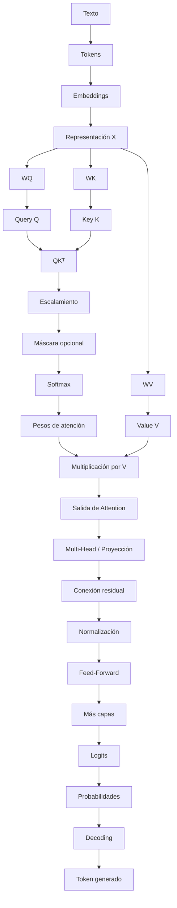

# 05 — Attention

> **Nivel:** Fundamentos → avanzado → maestría/PhD
> **Área:** Anatomía de un LLM
> **Prerrequisitos:** Tokens, embeddings y Transformer
> **Objetivo:** Comprender qué es la atención, cómo funciona matemáticamente, qué significan Query, Key y Value, cómo funciona Self-Attention y Multi-Head Attention, qué papel cumplen las máscaras y por qué la atención es fundamental para entender el comportamiento de los LLM.

---

# 1. ¿Qué es Attention?

En un Transformer, **Attention** es un mecanismo que permite calcular qué información de otras posiciones de una secuencia debe utilizarse para construir la representación de una posición determinada.

Dicho de forma sencilla:

> **Attention permite que un token tenga en cuenta otros tokens del contexto.**

Por ejemplo:

> `El gato persiguió al ratón porque estaba hambriento.`

Para interpretar correctamente:

```text
estaba
```

el modelo necesita relacionar ese token con otros elementos de la oración.

Podemos representarlo así:

```text
El ─────┐
gato ───┤
persiguió ───┐
al ─────┤    │
ratón ──┤    ├──► ATTENTION ──► representación contextual
porque ─┤    │
estaba ──┘    │
hambriento ───┘
```

La atención permite establecer relaciones ponderadas entre las diferentes posiciones.

---

# 2. La idea fundamental

Podemos resumir Attention con una pregunta:

> **"Dado lo que estoy procesando ahora, ¿qué otras partes de la secuencia son relevantes para construir mi representación?"**

No significa que el modelo tenga consciencia de lo que es "importante".

Es una operación matemática.

La intuición humana:

```text
¿Qué palabras necesito considerar?
```

se convierte matemáticamente en:

```text
¿Qué representaciones tienen mayor compatibilidad?
```

---

# 3. Un ejemplo sencillo

Consideremos:

> `El perro mordió al hombre porque estaba asustado.`

Para interpretar:

```text
estaba asustado
```

pueden existir relaciones con:

```text
perro
hombre
```

El mecanismo de atención permite calcular diferentes pesos.

Ejemplo didáctico:

```text
Token objetivo: "asustado"

El          → 0.02
perro       → 0.45
mordió      → 0.08
al          → 0.02
hombre      → 0.25
porque      → 0.05
estaba      → 0.10
asustado    → 0.03
```

Los números anteriores **no son valores reales de un modelo**.

Son únicamente una representación conceptual.

---

# 4. Atención como distribución de pesos

Podemos imaginar:

```text
                  ATENCIÓN

El          █
perro       █████████
mordió      ██
al          █
hombre      █████
porque      █
estaba      ██
asustado    █
```

La atención genera pesos que permiten combinar información.

Por eso podemos pensar:

$$
\text{Atención}
=
\text{pesos}
+
\text{información}
$$

Aunque matemáticamente el mecanismo es mucho más preciso que esta simplificación.

---

# 5. ¿Por qué necesitamos Attention?

Los embeddings iniciales representan tokens, pero necesitamos relacionarlos.

Consideremos:

```text
El gato duerme.
```

Tenemos:

```text
El       → vector
gato     → vector
duerme   → vector
```

Pero queremos obtener representaciones que incorporen contexto:

```text
El       → representación contextual
gato     → representación contextual
duerme   → representación contextual
```

La atención ayuda a construir esas representaciones.

---

# 6. Mapa conceptual



---

# 7. Query, Key y Value

Para comprender Attention debemos dominar tres conceptos:

```text
Q = Query
K = Key
V = Value
```

En español:

```text
Q → consulta
K → clave
V → valor
```

Estos nombres proceden de una analogía con sistemas de recuperación de información.

Una forma sencilla de recordarlos es:

```text
QUERY
¿Qué estoy buscando?

KEY
¿Qué tipo de información represento?

VALUE
¿Qué información aporto?
```

Esta es una analogía pedagógica, no una descripción literal de un proceso consciente.

---

# 8. Una analogía con una biblioteca

Imagina que buscas información.

Tu pregunta:

> "¿Cómo funciona un motor?"

es la:

```text
QUERY
```

Los libros tienen etiquetas:

```text
KEY

motor
automóvil
combustión
electricidad
historia
matemáticas
```

El sistema compara tu Query con las Keys.

Después recupera el contenido:

```text
VALUE
```

En Attention ocurre algo conceptualmente parecido:

```text
Query
   │
   ▼
comparación
   │
   ▼
Keys
   │
   ▼
pesos
   │
   ▼
Values
   │
   ▼
información combinada
```

---

# 9. Pero Attention no es un buscador tradicional

Esto es importante.

Attention no realiza necesariamente una búsqueda mediante:

```text
"buscar palabra X en una base de datos"
```

Q, K y V son vectores producidos mediante transformaciones matemáticas.

No existe necesariamente una tabla donde:

```text
QUERY = pregunta humana
KEY = etiqueta humana
VALUE = párrafo humano
```

Es una analogía.

---

# 10. De X a Q, K y V

Supongamos que tenemos:

$$
X
$$

que representa los embeddings de los tokens.

El modelo aprende tres transformaciones:

$$
Q = XW_Q
$$

$$
K = XW_K
$$

$$
V = XW_V
$$

Donde:

* \(X\) = representación de entrada;
* \(W_Q\) = matriz de parámetros para Query;
* \(W_K\) = matriz de parámetros para Key;
* \(W_V\) = matriz de parámetros para Value.

---

# 11. ¿Qué son las matrices W?

Son parámetros aprendidos durante el entrenamiento.

Por ejemplo:

$$
W_Q
$$

no es una matriz que un programador haya escrito manualmente con reglas lingüísticas.

Sus valores se ajustan durante el entrenamiento.

Conceptualmente:

```text
Datos
  │
  ▼
Entrenamiento
  │
  ▼
ajuste de parámetros
  │
  ▼
WQ, WK, WV
```

Por eso el modelo aprende qué transformaciones son útiles para representar relaciones.

---

# 12. Dimensiones

Supongamos:

$$
X \in \mathbb{R}^{n\times d_{model}}
$$

donde:

* \(n\) = número de tokens;
* \(d_{model}\) = dimensión del modelo.

Podemos tener:

```text
X

n tokens
   ×
d dimensiones
```

Entonces:

$$
W_Q \in \mathbb{R}^{d_{model}\times d_k}
$$

$$
W_K \in \mathbb{R}^{d_{model}\times d_k}
$$

$$
W_V \in \mathbb{R}^{d_{model}\times d_v}
$$

Por tanto:

$$
Q \in \mathbb{R}^{n\times d_k}
$$

$$
K \in \mathbb{R}^{n\times d_k}
$$

$$
V \in \mathbb{R}^{n\times d_v}
$$

---

# 13. ¿Qué queremos calcular?

Queremos saber cuánto debe influir cada token sobre otro.

Para eso calculamos:

$$
QK^T
$$

El resultado es una matriz:

$$
n\times n
$$

Esto es fundamental.

Si tenemos 5 tokens:

```text
Token 1
Token 2
Token 3
Token 4
Token 5
```

obtenemos relaciones:

```text
          Token
          1  2  3  4  5

Token 1   •  •  •  •  •
Token 2   •  •  •  •  •
Token 3   •  •  •  •  •
Token 4   •  •  •  •  •
Token 5   •  •  •  •  •
```

La matriz contiene puntuaciones de compatibilidad.

---

# 14. Matriz de atención

Podemos imaginar:

$$
QK^T =
\begin{bmatrix}
2.1 & 0.4 & 1.2\\
0.7 & 2.8 & 0.3\\
1.1 & 0.2 & 3.0
\end{bmatrix}
$$

Esto todavía **no es la distribución final de atención**.

Son puntuaciones.

Después debemos escalarlas y aplicar `softmax`.

---

# 15. ¿Qué significa una puntuación alta?

Supongamos:

```text
          gato   duerme   casa

gato       2.8     1.1     0.4
```

La puntuación:

```text
gato → gato = 2.8
```

es mayor que:

```text
gato → casa = 0.4
```

Esto indica que, según las representaciones aprendidas, existe mayor compatibilidad entre esas posiciones para esa cabeza y capa concreta.

Pero:

> **Una puntuación alta no significa automáticamente "importancia semántica" en sentido humano.**

Es una compatibilidad matemática utilizada por el mecanismo de atención.

---

# 16. ¿Por qué usamos \(QK^T\)?

El producto punto entre dos vectores:

$$
q\cdot k
$$

permite medir una forma de compatibilidad geométrica.

Si:

$$
q=[q_1,q_2,...,q_d]
$$

y:

$$
k=[k_1,k_2,...,k_d]
$$

entonces:

$$
q\cdot k
=
\sum_{i=1}^{d}q_i k_i
$$

Es decir:

```text
q1 × k1
+
q2 × k2
+
q3 × k3
+
...
+
qd × kd
```

---

# 17. Interpretación geométrica

El producto punto está relacionado con:

$$
q\cdot k
=
\|q\|\|k\|\cos(\theta)
$$

Por tanto depende de:

* magnitud de los vectores;
* ángulo entre ellos.

De forma intuitiva:

```text
Vectores más alineados
        ↓
mayor compatibilidad

Vectores menos alineados
        ↓
menor compatibilidad
```

Pero en un modelo real la interpretación es más compleja porque los vectores son representaciones aprendidas en espacios de alta dimensión.

---

# 18. El problema de los valores demasiado grandes

Si \(d_k\) aumenta, los productos punto pueden adquirir magnitudes grandes.

Eso puede hacer que `softmax` se vuelva demasiado concentrado.

Por eso se utiliza:

$$
\frac{QK^T}{\sqrt{d_k}}
$$

Este mecanismo se conoce como:

> **Scaled Dot-Product Attention**

---

# 19. La fórmula completa

La atención escalada se expresa como:

$$
\boxed{
Attention(Q,K,V)
=
softmax
\left(
\frac{QK^T}{\sqrt{d_k}}
\right)V
}
$$

Esta es una de las ecuaciones más importantes para comprender un Transformer.

Podemos dividirla:

```text
QKᵀ
 ↓
compatibilidad
 ↓
÷ √dk
 ↓
escalamiento
 ↓
softmax
 ↓
pesos
 ↓
× V
 ↓
información combinada
```

---

# 20. Softmax

La función softmax transforma puntuaciones en una distribución.

Para un conjunto:

$$
z_1,z_2,\dots,z_n
$$

tenemos:

$$
softmax(z_i)
=
\frac{e^{z_i}}
{\sum_j e^{z_j}}
$$

Sus propiedades principales son:

```text
cada valor > 0

y

suma de valores = 1
```

Ejemplo:

```text
Puntuaciones:

2.0
1.0
0.0
```

Después de softmax obtenemos aproximadamente:

```text
0.665
0.245
0.090
```

Ahora podemos interpretar estos valores como pesos relativos.

---

# 21. ¿Por qué no utilizar directamente las puntuaciones?

Porque necesitamos convertir:

```text
-2.4
 0.7
 3.1
 1.2
```

en valores que permitan construir una combinación ponderada.

Softmax produce algo conceptualmente parecido a:

```text
0.003
0.108
0.753
0.136
```

Los valores suman aproximadamente 1.

---

# 22. Del peso a la información

Supongamos:

```text
Token A → 0.10
Token B → 0.20
Token C → 0.70
```

y los Values:

```text
VA
VB
VC
```

Entonces:

$$
Y
=
0.10V_A
+
0.20V_B
+
0.70V_C
$$

Es decir:

```text
         VA ──× 0.10 ──┐
                        │
         VB ──× 0.20 ──┼──► SUMA ──► Y
                        │
         VC ──× 0.70 ──┘
```

La representación resultante contiene información combinada.

---

# 23. La atención como mezcla ponderada

Esta es una excelente forma de recordar el mecanismo:

> **Attention calcula pesos y utiliza esos pesos para mezclar Values.**

```text
                ATENCIÓN

Q ───┐
     ├──► compatibilidad ─► pesos
K ───┘                      │
                            ▼
                           V
                            │
                            ▼
                    mezcla ponderada
                            │
                            ▼
                         salida
```

---

# 24. Self-Attention

Cuando:

```text
Q
K
V
```

se obtienen de la **misma secuencia**, hablamos de:

> **Self-Attention**

Por ejemplo:

```text
Entrada:

El gato duerme.
```

Los tres conjuntos se derivan de esa misma entrada:

```text
X
│
├──► Q
├──► K
└──► V
```

Por eso el mecanismo puede relacionar tokens de una secuencia consigo misma.

---

# 25. Cross-Attention

Existe otra configuración:

```text
Q
```

proviene de una secuencia y:

```text
K, V
```

provienen de otra.

Esto se conoce como:

> **Cross-Attention**

Conceptualmente:

```text
Secuencia A
     │
     ▼
     Q
     │
     ├──────────────┐
                    │
Secuencia B         │
     │              │
     ├──► K         │
     └──► V         │
                    ▼
                Attention
```

Es especialmente importante en arquitecturas encoder-decoder.

---

# 26. Self-Attention vs Cross-Attention

| Característica | Self-Attention                | Cross-Attention                 |
| -------------- | ----------------------------- | ------------------------------- |
| Q              | misma secuencia               | una secuencia                   |
| K              | misma secuencia               | otra secuencia                  |
| V              | misma secuencia               | otra secuencia                  |
| Objetivo       | relacionar elementos internos | relacionar dos representaciones |
| Uso típico     | Transformers                  | Encoder-Decoder                 |

---

# 27. Ejemplo de Cross-Attention

Supongamos traducción:

```text
Entrada:
"The cat sleeps"
```

El encoder procesa:

```text
The
cat
sleeps
```

El decoder está generando:

```text
El gato duerme
```

El decoder puede utilizar Cross-Attention para consultar las representaciones del encoder.

Conceptualmente:

```text
Decoder
   │
   └── Q
        │
        ▼
     Atención
        ▲
        │
   K y V
        │
     Encoder
```

---

# 28. Atención causal

En modelos autoregresivos necesitamos impedir que una posición vea información futura.

Por ejemplo:

```text
El gato duerme hoy
```

Para predecir:

```text
duerme
```

podemos utilizar:

```text
El
gato
```

pero no:

```text
hoy
```

---

# 29. Máscara causal

Podemos representarla mediante:

```text
             El  gato  duerme  hoy

El           ✓    ✗      ✗      ✗
gato         ✓    ✓      ✗      ✗
duerme       ✓    ✓      ✓      ✗
hoy          ✓    ✓      ✓      ✓
```

Visualmente:

```text
█ ░ ░ ░
█ █ ░ ░
█ █ █ ░
█ █ █ █
```

La zona superior derecha queda bloqueada.

---

# 30. ¿Cómo se implementa la máscara?

Una técnica común consiste en asignar valores muy negativos a posiciones que no deben participar antes de aplicar softmax.

Conceptualmente:

```text
Puntuación:

2.1   0.4   -∞
1.2   2.3   -∞
0.5   1.1   3.0
```

Después de softmax:

```text
posición bloqueada
        ↓
probabilidad ≈ 0
```

El uso exacto de representaciones numéricas depende de la implementación y del tipo de máscara.

---

# 31. Atención y posición

Attention por sí misma no debe confundirse con un mecanismo completo de representación del orden.

Por eso los Transformers necesitan algún mecanismo para incorporar información posicional.

Por ejemplo:

```text
El gato
```

y:

```text
gato El
```

contienen los mismos tokens pero en posiciones diferentes.

La arquitectura debe poder distinguir sus posiciones.

Existen múltiples estrategias:

* positional encoding;
* positional embeddings;
* RoPE;
* ALiBi;
* otras variantes.

---

# 32. Multi-Head Attention

Una sola atención podría aprender un conjunto limitado de relaciones.

Por eso los Transformers utilizan múltiples cabezas.

Conceptualmente:

```text
                    Entrada
                       │
        ┌──────────────┼──────────────┐
        ▼              ▼              ▼
     Head 1         Head 2         Head 3
        │              │              │
     Atención       Atención       Atención
        │              │              │
        └──────────────┼──────────────┘
                       ▼
                    Concatenar
                       │
                       ▼
                 Proyección final
```

---

# 33. ¿Cada cabeza hace algo diferente?

Puede hacerlo.

Durante el análisis de modelos se han observado cabezas que parecen capturar determinados patrones.

Por ejemplo, conceptualmente:

```text
Head 1 → relaciones sintácticas
Head 2 → posiciones
Head 3 → referencias
Head 4 → patrones semánticos
```

Pero esta representación es pedagógica.

No debemos asumir:

> "Head 1 siempre significa sujeto."

La realidad puede ser mucho más distribuida y compleja.

---

# 34. Matemáticamente: múltiples cabezas

Cada cabeza tiene sus propias matrices:

$$
W_Q^{(h)}
$$

$$
W_K^{(h)}
$$

$$
W_V^{(h)}
$$

Por tanto:

$$
head_h
=
Attention
(Q_h,K_h,V_h)
$$

Después:

$$
MultiHead(Q,K,V)
=
Concat(head_1,\ldots,head_h)W_O
$$

donde:

* \(h\) = número de cabezas;
* `Concat` = concatenación;
* \(W_O\) = proyección de salida.

---

# 35. Mapa matemático



---

# 36. Multi-Head completo



---

# 37. ¿Por qué dividir la representación entre cabezas?

Si tenemos:

$$
d_{model}
$$

podemos distribuir la representación entre varias cabezas.

Conceptualmente:

```text
d_model = 768

       ↓

12 cabezas

       ↓

cada cabeza trabaja con
una dimensión parcial
```

Los valores concretos dependen del modelo.

La idea es permitir diferentes proyecciones y subespacios de representación.

---

# 38. Atención no significa "explicación"

Este punto es especialmente importante.

Es tentador decir:

> "Si una palabra recibe mucho attention, significa que el modelo utilizó esa palabra como explicación de su decisión."

Eso puede ser una simplificación incorrecta.

Los pesos de atención son parte del mecanismo de computación, pero:

> **Attention weights no constituyen automáticamente una explicación causal completa del comportamiento del modelo.**

La relación entre atención e interpretabilidad es un área de investigación.

---

# 39. Attention no es memoria

Otro error común:

> "Attention es la memoria del modelo."

No exactamente.

Attention permite realizar interacciones entre representaciones dentro del contexto disponible.

Podemos distinguir:

```text
Parámetros
   ↓
conocimiento aprendido

Contexto
   ↓
información disponible durante la ejecución

Attention
   ↓
mecanismo para combinar representaciones
```

---

# 40. Attention tampoco es RAG

RAG significa:

> Retrieval-Augmented Generation.

Un sistema RAG puede utilizar un mecanismo de recuperación externo:

```text
Consulta
   ↓
Embedding
   ↓
Base vectorial
   ↓
Documentos relevantes
   ↓
Contexto
   ↓
LLM
```

Attention ocurre dentro del modelo.

RAG es un patrón de arquitectura de sistema.

Por tanto:

```text
Attention ≠ RAG
```

---

# 41. Attention y contexto

Aquí aparece una relación fundamental:

```text
CONTEXTO
   │
   ▼
TOKENS
   │
   ▼
REPRESENTACIONES
   │
   ▼
ATTENTION
   │
   ▼
RELACIONES ENTRE POSICIONES
   │
   ▼
REPRESENTACIÓN CONTEXTUAL
```

Por eso el contenido y estructura del contexto pueden cambiar el resultado.

---

# 42. Ejemplo de contexto

Comparemos:

### Prompt A

```text
Resume este texto.
```

### Prompt B

```text
Resume este texto en tres puntos.
Separa hechos de opiniones.
Identifica riesgos.
No inventes información que no aparezca en el documento.
```

El segundo proporciona una estructura contextual diferente.

El modelo procesa tokens diferentes y, por tanto, las activaciones y predicciones pueden cambiar.

---

# 43. Attention y posición dentro del contexto

La relevancia de una información no depende exclusivamente de su contenido.

También puede verse afectada por:

* posición;
* estructura;
* repetición;
* formato;
* instrucciones;
* relaciones con otros tokens;
* arquitectura;
* entrenamiento;
* longitud del contexto.

Por eso una Ingeniería de Prompt profesional no consiste simplemente en agregar más texto.

---

# 44. Más tokens no significa más información útil

Supongamos:

```text
Contexto A

10 páginas relevantes
```

y:

```text
Contexto B

10 páginas relevantes
+
500 páginas irrelevantes
```

El segundo contexto contiene más tokens, pero no necesariamente proporciona una mejor condición para la tarea.

Podemos representarlo:

```text
Más contexto
      ≠
Más información útil
```

Esta distinción será fundamental cuando estudiemos **Context Engineering**.

---

# 45. Atención y longitud de secuencia

En atención estándar:

$$
QK^T
$$

produce una matriz aproximadamente:

$$
n\times n
$$

Por tanto, el número de interacciones potenciales crece aproximadamente como:

$$
O(n^2)
$$

Esto tiene implicaciones importantes.

```text
n = 1,000

interacciones ≈ 1,000,000
```

Mientras:

```text
n = 10,000

interacciones ≈ 100,000,000
```

No significa que todos los costos totales de un Transformer sean exactamente \(O(n^2)\), pero la atención estándar tiene esta dependencia cuadrática respecto de la longitud en esa parte del cálculo.

---

# 46. ¿Por qué importa?

Porque los modelos modernos trabajan con contextos cada vez mayores.

Por eso existen investigaciones y optimizaciones como:

* FlashAttention;
* Grouped-Query Attention;
* Multi-Query Attention;
* atención local;
* atención dispersa;
* estrategias de compresión;
* arquitecturas alternativas;
* mecanismos híbridos.

---

# 47. Multi-Query Attention

En **Multi-Query Attention (MQA)** se utilizan múltiples cabezas de Query, pero se comparten determinadas representaciones de Key y Value.

Conceptualmente:

```text
Q1 ──┐
Q2 ──┤
Q3 ──┤
Q4 ──┤
     │
     ├──► K compartida
     │
     └──► V compartida
```

Esto puede reducir determinados costes de memoria durante la inferencia.

---

# 48. Grouped-Query Attention

**Grouped-Query Attention (GQA)** se encuentra entre MHA y MQA.

Conceptualmente:

```text
Q1 ─┐
Q2 ─┤──► K1 / V1
     │
Q3 ─┐
Q4 ─┤──► K2 / V2
```

Varias cabezas de Query comparten grupos de Key y Value.

Esto busca un equilibrio entre:

* capacidad;
* calidad;
* memoria;
* velocidad de inferencia.

---

# 49. KV Cache

En generación autoregresiva, el modelo genera:

```text
Token 1
   ↓
Token 2
   ↓
Token 3
   ↓
Token 4
```

Sin optimización, sería ineficiente recalcular determinadas representaciones anteriores repetidamente.

Por eso se utiliza frecuentemente una estructura llamada:

> **KV Cache**

Conceptualmente:

```text
Paso 1
K1 V1

Paso 2
K1 V1 + K2 V2

Paso 3
K1 V1 + K2 V2 + K3 V3
```

Esto permite reutilizar Keys y Values previamente calculados durante la generación.

---

# 50. ¿Por qué KV Cache importa para Ingeniería de IA?

Porque conecta directamente la arquitectura con:

* latencia;
* memoria GPU;
* longitud de contexto;
* costo de inferencia;
* throughput;
* diseño de sistemas.

Un ingeniero de IA que solamente conoce el prompt pero no entiende estos mecanismos tendrá una visión incompleta del sistema.

---

# 51. Atención y generación autoregresiva

Podemos representar una generación:

```text
Prompt
  │
  ▼
Tokenización
  │
  ▼
Transformer
  │
  ▼
Token 1
  │
  ▼
Transformer
  │
  ▼
Token 2
  │
  ▼
Transformer
  │
  ▼
Token 3
  │
  ▼
...
```

El contexto va creciendo.

La atención permite utilizar información del contexto disponible.

---

# 52. Atención y logits

Después de las capas Transformer obtenemos representaciones que finalmente pueden transformarse en logits.

Simplificando:

```text
Attention
    │
    ▼
Representación
    │
    ▼
Proyección de salida
    │
    ▼
Logits
    │
    ▼
Softmax
    │
    ▼
Probabilidades
```

Por ejemplo:

```text
Quito      0.72
Lima       0.08
Bogotá     0.04
Guayaquil  0.03
...
```

Estos números son solo ilustrativos.

---

# 53. Attention no elige directamente el siguiente token

Es importante separar mecanismos.

Attention:

```text
relaciona representaciones
```

La capa de salida:

```text
produce logits
```

Softmax:

```text
convierte logits en probabilidades
```

Sampling/decoding:

```text
determina cómo seleccionar la salida
```

Por tanto:

```text
Attention
   ↓
representación
   ↓
logits
   ↓
probabilidades
   ↓
decoding
```

---

# 54. Atención y temperatura

La temperatura no pertenece conceptualmente al mecanismo de Attention.

La temperatura normalmente se aplica durante la transformación de logits utilizada para la distribución de salida.

Por ejemplo:

$$
P_i =
softmax
\left(
\frac{z_i}{T}
\right)
$$

donde:

* \(z_i\) = logit;
* \(T\) = temperatura.

Por tanto:

```text
Attention ≠ Temperature
```

Son mecanismos diferentes que ocurren en diferentes partes del proceso.

---

# 55. Atención vs Sampling

También debemos distinguir:

### Attention

Determina cómo combinar representaciones contextuales.

### Sampling

Determina cómo seleccionar tokens a partir de una distribución.

```text
              TRANSFORMER
                   │
                Attention
                   │
                   ▼
              Representación
                   │
                   ▼
                 Logits
                   │
                   ▼
              Probabilidades
                   │
                   ▼
              Sampling
                   │
                   ▼
            Token generado
```

---

# 56. Un ejemplo completo

Prompt:

> `El científico publicó el artículo porque`

Después de tokenización:

```text
El | científico | publicó | el | artículo | porque
```

El Transformer genera representaciones.

Attention puede establecer relaciones entre:

```text
científico
publicó
artículo
porque
```

Después:

```text
Representación contextual
          ↓
Logits
          ↓
Probabilidades
```

Ejemplo conceptual:

```text
estaba      0.31
contenía    0.08
quería      0.06
había       0.05
...
```

Se selecciona un token.

Supongamos:

```text
quería
```

Ahora tenemos:

```text
El científico publicó el artículo porque quería
```

Ese nuevo token forma parte del contexto para el siguiente paso.

---

# 57. El efecto cascada

Una característica importante de la generación autoregresiva es:

```text
Token generado
      ↓
Nuevo contexto
      ↓
Nueva atención
      ↓
Nueva distribución
      ↓
Nuevo token
```

Por tanto, una decisión temprana puede afectar decisiones posteriores.

Podemos representarlo:

```text
t1
 ↓
t2
 ↓
t3
 ↓
t4
 ↓
t5
```

Cada nuevo token condiciona el futuro.

Esto ayuda a comprender por qué una generación puede desviarse progresivamente de una intención inicial.

---

# 58. ¿Attention es el "razonamiento"?

No debemos establecer esa equivalencia.

Attention es un mecanismo fundamental para el procesamiento de información en muchos Transformers.

Pero:

```text
Attention
≠
razonamiento humano
```

Los comportamientos que llamamos "razonamiento" pueden emerger de la interacción de:

* arquitectura;
* parámetros;
* datos;
* entrenamiento;
* contexto;
* inferencia;
* herramientas;
* estrategias de generación.

Este tema será estudiado más adelante.

---

# 59. Attention y "comprensión"

Tampoco debemos afirmar:

> "Attention hace que el modelo comprenda."

Una formulación más precisa es:

> **Attention permite que las representaciones de diferentes posiciones interactúen dinámicamente, contribuyendo a la construcción de representaciones contextuales.**

Esta formulación es técnicamente más rigurosa.

---

# 60. Interpretabilidad de Attention

Podemos visualizar una matriz de atención:

```text
             El  gato  persigue  al  ratón

El           ▓    ░      ░      ░      ░
gato         ░    ▓      ░      ░      ░
persigue     ░    ▓      ▓      ░      ▓
al           ░    ░      ░      ▓      ░
ratón        ░    ░      ▓      ░      ▓
```

Las zonas más intensas representan mayores pesos de atención.

Esto puede ser útil para analizar modelos.

Pero debemos evitar concluir automáticamente:

```text
mayor attention
     ↓
mayor importancia causal
```

No existe una equivalencia universal entre ambas cosas.

---

# 61. Attention como grafo

Una forma avanzada de visualizarla es como un grafo.

```text
            gato
           ↗    ↘
        0.4      0.7
       ↗           ↘
     El           duerme
       ↘           ↗
        0.1      0.5
           ↘   ↙
            hoy
```

Cada token es un nodo.

Los pesos de atención representan conexiones ponderadas.

Conceptualmente:

$$
G=(V,E)
$$

donde:

* \(V\) = tokens;
* \(E\) = relaciones ponderadas.

Esta perspectiva puede ser útil para investigación de interpretabilidad.

---

# 62. Atención como matriz

También podemos representarla como:

$$
A \in \mathbb{R}^{n\times n}
$$

Cada elemento:

$$
A_{ij}
$$

representa el peso asociado a la relación entre determinadas posiciones \(i\) y \(j\), según la configuración concreta del mecanismo.

Por ejemplo:

$$
A=
\begin{bmatrix}
0.7&0.2&0.1\\
0.1&0.8&0.1\\
0.2&0.2&0.6
\end{bmatrix}
$$

Cada fila puede interpretarse como una distribución sobre posiciones, dependiendo de cómo esté definido el mecanismo.

---

# 63. Self-Attention completo

Podemos resumir:

```text
X
│
├────► WQ ───► Q
│
├────► WK ───► K
│
└────► WV ───► V

Q × Kᵀ
   │
   ▼
÷ √dk
   │
   ▼
Softmax
   │
   ▼
Attention weights
   │
   ▼
× V
   │
   ▼
Output
```

Esta secuencia es esencial.

---

# 64. Pseudocódigo conceptual

```python
Q = X @ W_Q
K = X @ W_K
V = X @ W_V

scores = Q @ K.T
scores = scores / sqrt(d_k)

weights = softmax(scores)

output = weights @ V
```

Este código es una representación educativa.

Una implementación real incluye:

* batching;
* máscaras;
* múltiples cabezas;
* optimizaciones de memoria;
* kernels especializados;
* precisión numérica;
* dispositivos aceleradores;
* paralelismo.

---

# 65. Implementación conceptual con máscara

Podemos ampliar:

```python
Q = X @ W_Q
K = X @ W_K
V = X @ W_V

scores = Q @ K.T
scores = scores / sqrt(d_k)

scores = apply_mask(scores)

weights = softmax(scores)

output = weights @ V
```

La máscara puede utilizarse para:

* causalidad;
* padding;
* restricciones específicas de arquitectura.

---

# 66. Atención y padding

Cuando se procesan secuencias de diferentes longitudes en un mismo batch, puede ser necesario rellenarlas.

Ejemplo:

```text
Secuencia A:
El gato duerme

Secuencia B:
El perro corre rápidamente
```

Podemos convertirlas en:

```text
A:
El | gato | duerme | PAD | PAD

B:
El | perro | corre | rápidamente | PAD
```

Los tokens `PAD` no deberían necesariamente participar como información real.

Por eso pueden utilizarse máscaras.

---

# 67. Tipos de máscaras

Dependiendo del sistema podemos encontrar:

### Causal mask

Impide acceder a posiciones futuras.

### Padding mask

Evita utilizar posiciones de relleno.

### Attention mask específica

Puede imponer otras restricciones según la arquitectura.

Esto demuestra que:

> **Attention no es solamente una fórmula; también es un mecanismo condicionado por reglas de visibilidad.**

---

# 68. ¿Qué sucede cuando el contexto es enorme?

Una secuencia larga puede producir una matriz de atención enorme.

Conceptualmente:

```text
10 tokens
   ↓
100 relaciones

100 tokens
   ↓
10.000 relaciones

1.000 tokens
   ↓
1.000.000 relaciones
```

Esto ayuda a comprender por qué el contexto largo tiene un coste computacional significativo.

---

# 69. Eficiencia: FlashAttention

Una de las optimizaciones importantes es **FlashAttention**.

La idea no consiste simplemente en cambiar la fórmula matemática.

Busca implementar el cálculo de atención de manera mucho más eficiente en hardware moderno, especialmente reduciendo movimientos innecesarios de datos entre distintos niveles de memoria.

Conceptualmente:

```text
Atención ingenua
      │
      ▼
muchos movimientos de memoria
      │
      ▼
menor eficiencia

FlashAttention
      │
      ▼
cálculo optimizado
      │
      ▼
mejor uso de memoria
```

Es importante distinguir:

```text
algoritmo matemático
```

de:

```text
implementación eficiente del algoritmo
```

---

# 70. Attention en hardware

El cálculo real ocurre normalmente en aceleradores como:

* GPU;
* TPU;
* otros aceleradores especializados.

La eficiencia depende de:

* operaciones matriciales;
* memoria;
* ancho de banda;
* paralelismo;
* precisión numérica;
* tamaño del batch;
* longitud del contexto;
* implementación del kernel.

Por eso comprender Attention también tiene valor para ingeniería de sistemas de IA.

---

# 71. Attention y precisión numérica

Los modelos modernos pueden utilizar diferentes formatos numéricos.

Por ejemplo:

* FP32;
* FP16;
* BF16;
* FP8;
* otras técnicas de cuantización.

Esto afecta:

* memoria;
* velocidad;
* estabilidad;
* precisión.

Por tanto, el comportamiento de Attention también depende de cómo se implementa numéricamente.

---

# 72. Attention en diferentes arquitecturas

Podemos resumir:

```text
                         ATTENTION
                             │
          ┌──────────────────┼─────────────────┐
          │                  │                 │
     Self-Attention     Cross-Attention   Variantes
          │                  │                 │
          │                  │          ┌──────┼──────┐
          │                  │          │      │      │
       Encoder            Encoder-    MHA    MQA    GQA
       Decoder            Decoder
```

La palabra "Attention" engloba una familia de mecanismos relacionados.

---

# 73. Atención en un decoder-only

Un modelo autoregresivo puede utilizar:

```text
Causal Self-Attention
```

El flujo simplificado:

```text
Prompt
  │
  ▼
Tokens
  │
  ▼
Embeddings
  │
  ▼
Causal Self-Attention
  │
  ▼
FFN
  │
  ▼
Más capas
  │
  ▼
Logits
```

---

# 74. Atención en un encoder

En un encoder puede utilizarse Self-Attention donde una posición pueda interactuar con otras posiciones de la entrada según las reglas de la arquitectura.

Por ejemplo:

```text
El gato duerme
```

Una posición puede acceder a información de otras posiciones.

Esto permite construir representaciones bidireccionales en arquitecturas que utilizan ese tipo de atención.

---

# 75. Diferencia conceptual

```text
ENCODER

Token
 ↕
otros tokens

Puede utilizar contexto de diferentes posiciones
según la máscara utilizada.


DECODER AUTOREGRESIVO

Token actual
 ↓
tokens anteriores

No puede utilizar tokens futuros.
```

Esta diferencia es fundamental.

---

# 76. Attention y prompt injection

Este concepto será estudiado profundamente en seguridad, pero podemos adelantar una idea.

Supongamos que un sistema recibe:

```text
Instrucción del sistema
+
instrucción del usuario
+
documento externo
```

Todo termina convertido, directa o indirectamente, en contexto procesable por el modelo.

El Transformer no posee automáticamente una frontera perfecta que diga:

```text
esto es una instrucción legítima
esto es solamente contenido
```

El sistema necesita mecanismos adicionales para controlar jerarquías, permisos y herramientas.

Por eso:

> **La seguridad de un sistema LLM no puede depender exclusivamente del prompt.**

---

# 77. Atención no garantiza obediencia

Aunque escribamos:

```text
IGNORA TODO LO ANTERIOR
```

no existe una regla matemática que garantice que el modelo obedecerá esa instrucción.

La salida depende de:

* parámetros;
* entrenamiento;
* contexto;
* jerarquía de instrucciones;
* arquitectura;
* inferencia;
* filtros;
* herramientas;
* políticas del sistema.

Por eso la Ingeniería de Prompt profesional debe comprender el sistema completo.

---

# 78. Atención y estructura del prompt

Una estructura clara puede ayudar al modelo a diferenciar elementos.

Por ejemplo:

```text
ROL
TAREA
CONTEXTO
RESTRICCIONES
FORMATO DE SALIDA
```

Conceptualmente:

```text
┌─────────────────────────┐
│ ROL                     │
├─────────────────────────┤
│ TAREA                   │
├─────────────────────────┤
│ CONTEXTO                │
├─────────────────────────┤
│ RESTRICCIONES           │
├─────────────────────────┤
│ FORMATO                 │
└─────────────────────────┘
```

Esto no significa que Attention "entienda cajas".

Significa que una estructura consistente modifica las relaciones entre los tokens y puede facilitar que el modelo produzca el comportamiento esperado.

---

# 79. ¿Por qué los ejemplos ayudan?

Consideremos:

```text
Clasifica:

"Excelente servicio" → POSITIVO
"Muy mala atención" → NEGATIVO

Ahora:

"El producto funciona perfectamente" →
```

Los ejemplos proporcionan contexto adicional.

El modelo puede utilizar las relaciones entre:

```text
entrada
+
ejemplos
+
estructura
```

para inferir el patrón de la tarea.

Esto conecta con:

> **Few-shot prompting**

que estudiaremos posteriormente.

---

# 80. Attention no reemplaza el entrenamiento

Podemos tener un excelente prompt, pero el modelo sigue limitado por:

* datos de entrenamiento;
* arquitectura;
* parámetros;
* capacidad;
* contexto;
* conocimiento disponible;
* herramientas;
* estrategia de inferencia.

Por eso:

```text
Buen prompt
     ≠
Modelo omnisciente
```

---

# 81. Mapa conceptual completo



---

# 82. Tabla de conceptos

| Concepto             | Qué hace                                            | No debe confundirse con           |
| -------------------- | --------------------------------------------------- | --------------------------------- |
| Query                | Representa la consulta de una posición              | Una pregunta humana               |
| Key                  | Representa características utilizadas para comparar | Una etiqueta explícita            |
| Value                | Información que puede incorporarse                  | Un valor semántico humano         |
| Dot Product          | Calcula compatibilidad                              | Una medida universal de similitud |
| Softmax              | Convierte puntuaciones en distribución              | Selección final del token         |
| Self-Attention       | Relaciona posiciones de una misma secuencia         | RAG                               |
| Cross-Attention      | Relaciona representaciones de dos secuencias        | Self-Attention                    |
| Causal Mask          | Bloquea información futura                          | Memoria                           |
| Multi-Head Attention | Ejecuta múltiples proyecciones de atención          | Múltiples modelos                 |
| KV Cache             | Reutiliza K/V durante generación                    | Memoria de largo plazo            |
| Sampling             | Selecciona tokens según una estrategia              | Attention                         |

---

# 83. Errores que debes evitar

## Error 1

> "Attention busca palabras importantes."

Más preciso:

> Attention calcula pesos de interacción entre representaciones.

---

## Error 2

> "Q es la pregunta del usuario."

No necesariamente.

Q es una representación calculada mediante una transformación aprendida.

---

## Error 3

> "K contiene palabras clave."

No necesariamente.

K contiene representaciones vectoriales generadas por el modelo.

---

## Error 4

> "V es el significado de la palabra."

No exactamente.

V es una representación transformada utilizada en la combinación ponderada.

---

## Error 5

> "Attention explica exactamente por qué el modelo respondió algo."

No necesariamente.

Los pesos de atención no constituyen por sí solos una explicación causal completa.

---

## Error 6

> "Attention es memoria."

No.

Es un mecanismo de interacción entre representaciones.

---

## Error 7

> "Attention es RAG."

No.

RAG es una arquitectura de recuperación y generación.

---

## Error 8

> "Más Attention significa mejor modelo."

No necesariamente.

La arquitectura completa, el entrenamiento, los datos, la capacidad, la inferencia y otros factores importan.

---

# 84. Nivel avanzado: derivación conceptual

Partimos de:

$$
X
$$

y calculamos:

$$
Q=XW_Q
$$

$$
K=XW_K
$$

$$
V=XW_V
$$

Después:

$$
S=QK^T
$$

Escalamos:

$$
\hat{S}
=
\frac{S}{\sqrt{d_k}}
$$

Aplicamos una máscara cuando corresponde:

$$
\tilde{S}
=
\hat{S}+M
$$

donde las posiciones bloqueadas pueden recibir valores suficientemente negativos para que su probabilidad posterior sea prácticamente cero.

Después:

$$
A=softmax(\tilde{S})
$$

Finalmente:

$$
Y=AV
$$

Por tanto:

$$
\boxed{
Y=
softmax
\left(
\frac{QK^T+M}{\sqrt{d_k}}
\right)V
}
$$

Esta forma representa de manera compacta el proceso conceptual.

---

# 85. Nivel maestría: ¿qué está aprendiendo realmente el modelo?

Las matrices:

$$
W_Q,\ W_K,\ W_V
$$

no contienen reglas explícitas como:

```text
"los sustantivos deben mirar a los verbos"
```

El entrenamiento modifica los parámetros para minimizar una función objetivo.

Como resultado pueden emerger patrones de representación e interacción.

Esto nos lleva a una pregunta mucho más profunda:

> **¿Cómo emergen capacidades lingüísticas y conceptuales a partir de transformaciones matemáticas aprendidas?**

Esa pregunta pertenece al área de:

* interpretabilidad mecanicista;
* representación interna;
* circuitos neuronales;
* análisis de activaciones;
* aprendizaje profundo.

---

# 86. Nivel PhD: preguntas de investigación

Al profundizar en Attention aparecen preguntas como:

### 1. ¿Qué representa cada cabeza?

No siempre existe una correspondencia uno-a-uno entre una cabeza y una función interpretable.

### 2. ¿Las cabezas son independientes?

No necesariamente.

Puede existir redundancia, especialización parcial o comportamiento distribuido.

### 3. ¿Dónde se almacena la información?

No existe una única respuesta simple.

La información puede estar distribuida entre:

* pesos;
* activaciones;
* capas;
* neuronas;
* cabezas;
* circuitos.

### 4. ¿Attention es suficiente para explicar capacidades emergentes?

No existe una respuesta universal.

La atención es una pieza del sistema, no necesariamente una explicación completa de todas sus capacidades.

### 5. ¿Cómo escalar atención eficientemente?

Esto conduce a investigación sobre:

* sparse attention;
* local attention;
* linear attention;
* FlashAttention;
* GQA;
* MQA;
* arquitecturas híbridas;
* alternativas al Transformer.

---

# 87. La relación entre Attention y Prompt Engineering

Podemos ahora establecer una conexión mucho más precisa:

```text
                 PROMPT
                    │
                    ▼
                 TOKENS
                    │
                    ▼
               REPRESENTACIÓN
                    │
                    ▼
                 ATTENTION
                    │
          ┌─────────┼─────────┐
          ▼         ▼         ▼
       contexto   relaciones  posición
          │         │         │
          └─────────┼─────────┘
                    ▼
              REPRESENTACIÓN
               CONTEXTUAL
                    │
                    ▼
                  LOGITS
                    │
                    ▼
              PROBABILIDADES
                    │
                    ▼
                GENERACIÓN
```

Esto explica por qué la estructura del prompt puede afectar el comportamiento del modelo.

---

# 88. Una conclusión fundamental

La Ingeniería de Prompt no consiste únicamente en:

> "escribir frases bonitas para la IA."

Una visión técnica es:

> **Diseñar las condiciones de entrada y contexto que permitan que el modelo produzca una distribución de salida adecuada para una tarea determinada.**

Y para entender por qué esto funciona, debemos comprender:

```text
Tokens
   ↓
Embeddings
   ↓
Attention
   ↓
Transformer
   ↓
Representaciones
   ↓
Logits
   ↓
Probabilidades
   ↓
Decoding
```

---

# 89. Resumen final

### Attention

Es un mecanismo matemático que permite combinar información de diferentes posiciones.

### Self-Attention

Utiliza la misma secuencia para construir Q, K y V.

### Cross-Attention

Utiliza Q de una representación y K/V de otra.

### Q

Representación utilizada para calcular compatibilidad.

### K

Representación contra la que se compara Q.

### V

Información que se combina utilizando los pesos calculados.

### Scaled Dot-Product Attention

$$
softmax
\left(
\frac{QK^T}{\sqrt{d_k}}
\right)V
$$

### Multi-Head Attention

Permite realizar múltiples proyecciones de atención.

### Causal Attention

Impide que un token acceda a información futura durante la generación autoregresiva.

### KV Cache

Permite reutilizar determinadas representaciones durante la generación.

### Attention ≠ razonamiento

Es un mecanismo fundamental del Transformer, pero no debe equipararse directamente con el razonamiento humano.

### Attention ≠ memoria

Es un mecanismo de interacción entre representaciones.

### Attention ≠ RAG

RAG es un patrón de sistema que puede aportar información externa al modelo.

---

# 90. Mapa final: de tokens a atención

```mermaid id="k8p4a7"
flowchart LR
    A[Texto] --> B[Tokens]
    B --> C[Embeddings]
    C --> D[X]

    D --> E[Q]
    D --> F[K]
    D --> G[V]

    E --> H[QKᵀ]
    F --> H

    H --> I[/ √dk]
    I --> J[Máscara]
    J --> K[Softmax]
    K --> L[Pesos]

    L --> M[Pesos × V]
    G --> M

    M --> N[Representación contextual]
    N --> O[Transformer]
    O --> P[Logits]
    P --> Q[Probabilidades]
    Q --> R[Decoding]
    R --> S[Token]
```

---

# 91. Conexión con el siguiente capítulo

Ya sabemos:

```text
01 — Qué es un LLM
02 — Tokenización
03 — Embeddings
04 — Transformer
05 — Attention
```

Ahora tenemos una pregunta importante:

> **Si Attention permite relacionar tokens, ¿cómo sabe el modelo dónde está cada token dentro de la secuencia?**

Porque:

```text
"El perro persigue al gato"
```

no significa exactamente lo mismo que:

```text
"El gato persigue al perro"
```

Los tokens pueden ser prácticamente los mismos, pero sus posiciones y relaciones cambian.

Por eso el siguiente capítulo será:

```text
06-Positional-Information.md
```

Allí estudiaremos:

* por qué un Transformer necesita información posicional;
* positional encoding;
* positional embeddings;
* información absoluta y relativa;
* RoPE;
* ALiBi;
* limitaciones de los mecanismos posicionales;
* contexto largo;
* extrapolación de posiciones;
* relación entre posición, atención y prompt;
* por qué la posición de una instrucción dentro del contexto puede importar.

> **Idea para recordar:**
> **Attention determina cómo pueden interactuar las representaciones; la información posicional ayuda al modelo a distinguir dónde están esas representaciones dentro de la secuencia.**
