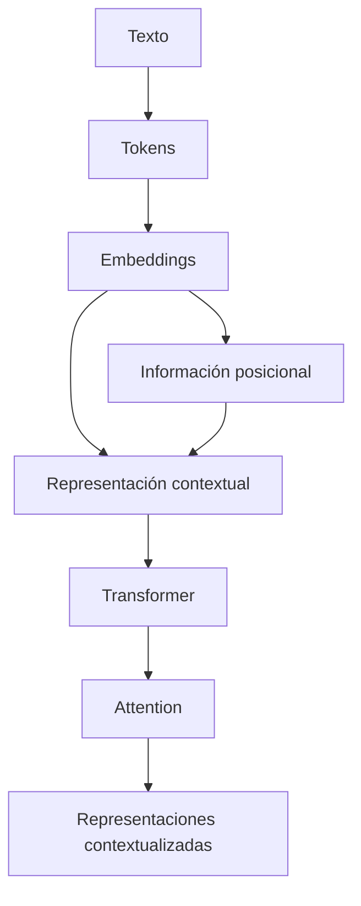
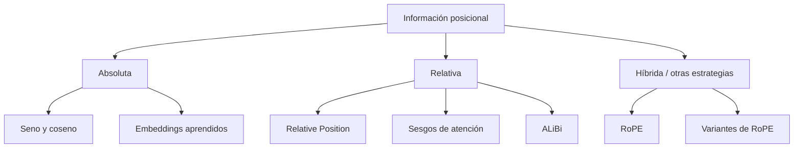

# 06 — Positional Information

> **Nivel:** Fundamentos → avanzado → maestría/PhD
> **Área:** Anatomía de un LLM
> **Prerrequisitos:** Tokens, embeddings, Transformer y Attention
> **Objetivo:** Comprender cómo los Transformers representan la posición y el orden de los tokens, por qué Attention por sí sola no es suficiente para distinguir una secuencia de otra, cómo funcionan los principales mecanismos posicionales y por qué la posición del contenido puede afectar el comportamiento de un LLM.

---

# 1. El problema fundamental

En el capítulo anterior vimos que Attention permite que diferentes tokens interactúen.

Pero aparece una pregunta fundamental:

> **¿Cómo sabe un Transformer dónde está cada token?**

Consideremos:

```text
El perro persigue al gato.
```

y:

```text
El gato persigue al perro.
```

Tenemos prácticamente los mismos tokens:

```text
El
perro
persigue
al
gato
```

pero están organizados de manera diferente.

Y el significado cambia.

```text
El perro persigue al gato
          ≠
El gato persigue al perro
```

Por tanto, el modelo necesita información sobre:

* posición;
* orden;
* distancia;
* relaciones espaciales dentro de la secuencia.

---

# 2. La idea central

Una frase puede representarse inicialmente como:

```text
Token 1
Token 2
Token 3
Token 4
Token 5
```

Pero el Transformer necesita distinguir:

```text
gato está en posición 2
```

de:

```text
gato está en posición 5
```

Por eso necesitamos algún mecanismo de:

> **Información posicional (Positional Information).**

---

# 3. Una analogía sencilla

Imagina una fila de estudiantes:

```text
Ana    Luis    Pedro    María
 1       2       3        4
```

Si eliminamos los números:

```text
Ana    Luis    Pedro    María
```

todavía tenemos los nombres, pero hemos perdido una representación explícita de sus posiciones.

Ahora cambiemos el orden:

```text
María    Pedro    Luis    Ana
```

Los mismos estudiantes aparecen, pero las posiciones son diferentes.

Con tokens ocurre algo parecido.

---

# 4. Token + posición

Conceptualmente podemos pensar:

```text
Token
  +
posición
  ↓
representación utilizada por el Transformer
```

Por ejemplo:

```text
El       + posición 1
gato     + posición 2
duerme   + posición 3
```

No significa necesariamente que todos los modelos sumen literalmente un vector de posición al embedding.

Ese detalle depende de la arquitectura.

La idea general es:

> **El modelo necesita incorporar información sobre la posición de las representaciones dentro de la secuencia.**

---

# 5. Un Transformer sin información posicional

Supongamos una secuencia:

```text
A B C
```

y otra:

```text
C B A
```

Si solamente utilizáramos representaciones de tokens y una operación de atención que tratara las posiciones de forma indistinguible, podríamos perder información esencial sobre el orden.

Conceptualmente:

```text
A B C
 │ │ │
 └─┼─┘
   │
representaciones
   │
   ▼
¿Dónde estaba A?
¿Dónde estaba B?
¿Dónde estaba C?
```

El modelo necesita una señal adicional.

---

# 6. El problema matemático

Supongamos que tenemos:

$$
X=
\begin{bmatrix}
x_1\\
x_2\\
x_3
\end{bmatrix}
$$

donde:

* \(x_1\) representa el primer token;
* \(x_2\) representa el segundo;
* \(x_3\) representa el tercero.

La atención calcula relaciones entre representaciones.

Pero necesitamos que:

$$
x_1
$$

sea distinguible de:

$$
x_3
$$

incluso cuando los tokens o sus representaciones puedan ser iguales.

---

# 7. Un ejemplo extremo

Consideremos:

```text
A A A A
```

Tenemos cuatro tokens iguales.

Si solamente miramos el embedding del token:

```text
A → vector X
A → vector X
A → vector X
A → vector X
```

¿cómo distinguirlos?

Necesitamos información adicional:

```text
A + posición 1
A + posición 2
A + posición 3
A + posición 4
```

Así:

```text
posición 1 ≠ posición 2
```

aunque:

```text
token 1 = token 2
```

---

# 8. Mapa conceptual



---

# 9. ¿Dónde se incorpora la posición?

Existen diferentes estrategias.

Entre las más importantes encontramos:

```text
Información posicional
│
├── Positional Encoding
│
├── Positional Embeddings
│
├── Relative Position Representations
│
├── RoPE
│
├── ALiBi
│
└── otras variantes
```

No todos los Transformers modernos utilizan exactamente el mismo mecanismo.

---

# 10. Positional Encoding

Una de las soluciones originales del Transformer fue utilizar funciones deterministas para generar representaciones de posición.

El artículo:

> **Attention Is All You Need**

introdujo un esquema basado en funciones seno y coseno.

La idea era construir un vector diferente para cada posición.

---

# 11. La fórmula clásica

Para una posición \(pos\) y dimensión \(i\):

$$
PE(pos,2i)
=
\sin
\left(
\frac{pos}{10000^{2i/d_{model}}}
\right)
$$

y:

$$
PE(pos,2i+1)
=
\cos
\left(
\frac{pos}{10000^{2i/d_{model}}}
\right)
$$

donde:

* \(pos\) = posición;
* \(i\) = índice de dimensión;
* \(d_{model}\) = dimensión del modelo.

---

# 12. ¿Por qué seno y coseno?

No se escogieron simplemente para generar números diferentes.

Estas funciones tienen propiedades útiles para representar posiciones y relaciones entre ellas.

Por ejemplo:

```text
posición 1 → patrón de ondas
posición 2 → patrón ligeramente diferente
posición 3 → otro patrón
...
```

Podemos imaginar:

```text
Posición

1  ~~~~~
2   ~~~~~
3    ~~~~~
4     ~~~~~
5      ~~~~~
```

Cada posición produce una combinación diferente de frecuencias.

---

# 13. Varias frecuencias

La característica importante es que diferentes dimensiones pueden utilizar diferentes frecuencias.

Conceptualmente:

```text
Dimensión 1 → frecuencia alta
Dimensión 2 → frecuencia alta
Dimensión 3 → frecuencia media
Dimensión 4 → frecuencia baja
...
```

Por eso el vector posicional contiene múltiples escalas.

```text
posición
   │
   ├── frecuencia rápida
   ├── frecuencia media
   └── frecuencia lenta
```

Esto permite representar diferentes patrones de distancia y posición.

---

# 14. Ejemplo conceptual

No utilizaremos los valores reales de un modelo.

Supongamos:

```text
posición 1
[0.84, 0.54, 0.01, 1.00]

posición 2
[0.91, -0.42, 0.02, 1.00]

posición 3
[0.14, -0.99, 0.03, 1.00]
```

Estos vectores son solamente ilustrativos.

La idea es que:

```text
PE(1) ≠ PE(2) ≠ PE(3)
```

---

# 15. Embedding + posición

En el Transformer original, la representación de entrada podía construirse como:

$$
X = E + PE
$$

donde:

* \(E\) = embedding del token;
* \(PE\) = representación posicional.

Visualmente:

```text
Token
 │
 ▼
Embedding ─────┐
               ├──► suma ───► X
Posición ──────┘
```

Después:

```text
X
 ↓
Transformer
 ↓
Attention
```

---

# 16. ¿La posición es otro token?

No.

Esta distinción es importante.

Una posición no necesariamente se convierte en un token adicional.

Por ejemplo:

```text
El | gato | duerme
```

no se transforma necesariamente en:

```text
[POS1] | El | [POS2] | gato | [POS3] | duerme
```

En los mecanismos clásicos, la información posicional se representa mediante vectores asociados a las posiciones.

---

# 17. Positional Embeddings

Otra estrategia consiste en aprender un vector asociado a cada posición.

Por ejemplo:

```text
posición 1 → P1
posición 2 → P2
posición 3 → P3
posición 4 → P4
```

Estos vectores forman parte de los parámetros aprendidos.

Conceptualmente:

```text
posición
   ↓
tabla de posiciones
   ↓
vector posicional
```

---

# 18. Positional Encoding vs Positional Embedding

Podemos establecer una diferencia pedagógica:

| Característica                     | Positional Encoding clásico | Positional Embedding aprendido   |
| ---------------------------------- | --------------------------- | -------------------------------- |
| Valores                            | Generados por una función   | Aprendidos                       |
| Parámetros adicionales             | No necesariamente           | Sí                               |
| Ejemplo clásico                    | Seno/coseno                 | Tabla de vectores                |
| Flexibilidad                       | Determinista                | Aprendida                        |
| Generalización a posiciones nuevas | Puede tener ventajas        | Puede depender del entrenamiento |

---

# 19. El problema de las posiciones absolutas

Supongamos:

```text
posición 1
posición 2
posición 3
...
posición 4096
```

Podemos representar posiciones absolutas.

Pero muchas relaciones lingüísticas dependen más de:

> **¿Qué tan lejos están dos tokens?**

que de:

> **¿Cuál es la posición absoluta de cada token?**

Por ejemplo:

```text
gato → duerme
```

puede depender de que están separados por una determinada distancia.

---

# 20. Posición relativa

Podemos representar:

```text
Token A
   │
   │ +2
   ▼
Token B
```

en lugar de almacenar solamente:

```text
A = posición 10
B = posición 12
```

La diferencia:

$$
12-10=2
$$

puede ser relevante.

Esto conduce a:

> **Relative Positional Information**

---

# 21. Absoluta vs relativa

```text
POSICIÓN ABSOLUTA

A = 10
B = 12

        ↓

relación:
B está en posición 12


POSICIÓN RELATIVA

A = 10
B = 12

        ↓

B está +2 respecto de A
```

La segunda representación puede capturar relaciones que son más independientes de la ubicación absoluta.

---

# 22. ¿Por qué esto importa para los LLM?

Porque una frase puede aparecer en diferentes lugares del contexto.

Ejemplo:

```text
Documento A

El concepto importante aparece
en el token 200.
```

y:

```text
Documento B

El mismo concepto aparece
en el token 5000.
```

Una representación puramente absoluta podría tratar esas posiciones de forma diferente.

Los mecanismos relativos buscan representar mejor ciertas relaciones que pueden mantenerse aunque cambie la ubicación absoluta.

---

# 23. Rotary Position Embedding — RoPE

Uno de los mecanismos posicionales más importantes en LLM modernos es:

> **Rotary Position Embedding (RoPE).**

RoPE fue propuesto para incorporar información posicional mediante rotaciones de las representaciones, especialmente en el espacio de Query y Key.

La idea fundamental:

> **La posición modifica geométricamente Q y K de una manera que permite que su interacción dependa de la posición relativa.**

---

# 24. La intuición de RoPE

Imaginemos un vector:

```text
      ↑
      │
      │   ●
      │  /
      │ /
──────┼────────►
```

Ahora aplicamos una rotación.

```text
      ↑
      │ ●
      │/
      │
──────┼────────►
```

La dirección cambia.

La magnitud puede mantenerse.

RoPE utiliza rotaciones parametrizadas por la posición.

---

# 25. RoPE conceptualmente

Podemos representar:

```text
Token
  │
  ▼
Q ───► rotación según posición ───► Q'
K ───► rotación según posición ───► K'
  │
  ▼
Q'K'ᵀ
```

La posición se incorpora directamente en la geometría de Q y K.

---

# 26. ¿Por qué RoPE afecta Attention?

Porque Attention utiliza:

$$
QK^T
$$

Si modificamos Q y K mediante rotaciones dependientes de la posición:

$$
Q' = R_{pos}(Q)
$$

$$
K' = R_{pos}(K)
$$

entonces:

$$
Q'K'^T
$$

incorpora información posicional.

Esta es una de las ideas centrales de RoPE.

---

# 27. RoPE y posición relativa

Una propiedad importante de RoPE es que la interacción entre dos posiciones puede depender de su diferencia relativa.

Conceptualmente:

```text
posición A = 100
posición B = 105

distancia = +5
```

El mecanismo puede representar la relación mediante la diferencia de las posiciones angulares.

Por eso RoPE resulta especialmente atractivo para Transformers autoregresivos.

---

# 28. ¿RoPE agrega tokens?

No.

No transforma:

```text
El gato duerme
```

en:

```text
POS1 El POS2 gato POS3 duerme
```

La información se incorpora a las representaciones utilizadas en la atención.

---

# 29. Visualización conceptual de RoPE

```text
                 POSICIÓN

Token 1 ──► Q ──► rotación θ₁ ──► Q₁'
Token 2 ──► Q ──► rotación θ₂ ──► Q₂'
Token 3 ──► Q ──► rotación θ₃ ──► Q₃'

Token 1 ──► K ──► rotación θ₁ ──► K₁'
Token 2 ──► K ──► rotación θ₂ ──► K₂'
Token 3 ──► K ──► rotación θ₃ ──► K₃'

                     ↓

                 Attention
```

---

# 30. ¿Qué significa "rotary"?

Significa que se utilizan transformaciones equivalentes a rotaciones en subespacios de las representaciones.

No debemos imaginar que todo el vector completo se gira necesariamente como un objeto tridimensional.

En implementaciones prácticas, RoPE suele aplicarse mediante rotaciones en pares de dimensiones.

---

# 31. RoPE a nivel matemático

Para un par de componentes:

$$
(x_1,x_2)
$$

podemos aplicar una rotación:

$$
\begin{bmatrix}
x'_1\\
x'_2
\end{bmatrix}
=
\begin{bmatrix}
\cos\theta & -\sin\theta\\
\sin\theta & \cos\theta
\end{bmatrix}
\begin{bmatrix}
x_1\\
x_2
\end{bmatrix}
$$

donde:

$$
\theta
$$

depende de la posición y de la frecuencia correspondiente.

---

# 32. ¿Por qué pares de dimensiones?

Porque una rotación bidimensional puede aplicarse a cada pareja:

```text
(x1, x2)
(x3, x4)
(x5, x6)
...
```

Cada pareja puede utilizar una frecuencia diferente.

Conceptualmente:

```text
Vector Q

[x1 x2 | x3 x4 | x5 x6 | ...]

   ↓       ↓       ↓

rotación rotación rotación

   ↓       ↓       ↓

[x1' x2' | x3' x4' | x5' x6' | ...]
```

---

# 33. RoPE y frecuencias

Al igual que en el encoding sinusoidal, diferentes dimensiones pueden utilizar diferentes escalas.

Podemos imaginar:

```text
Dimensiones
│
├── frecuencia alta
├── frecuencia alta
├── frecuencia media
├── frecuencia media
└── frecuencia baja
```

Esto permite representar diferentes escalas de posición.

---

# 34. ALiBi

Otra estrategia conocida es:

> **Attention with Linear Biases (ALiBi).**

En lugar de modificar directamente los embeddings, se añade un sesgo relacionado con la distancia a las puntuaciones de atención.

Conceptualmente:

$$
Score_{ij}
=
q_i k_j^T
-
m|i-j|
$$

donde:

* \(i\) = posición de consulta;
* \(j\) = posición de la clave;
* \(m\) = pendiente o factor asociado a la cabeza.

La fórmula exacta puede variar según la implementación.

---

# 35. Intuición de ALiBi

Supongamos:

```text
Token actual
    │
    ├── token cercano
    │
    ├──── token algo más lejano
    │
    └──────── token muy lejano
```

El sesgo puede penalizar determinadas distancias.

Conceptualmente:

```text
distancia pequeña → penalización pequeña
distancia grande   → penalización mayor
```

Esto introduce una preferencia posicional directamente en los scores de atención.

---

# 36. Comparación conceptual

```text
Método clásico
Embedding + posición

RoPE
Q/K + rotación posicional

ALiBi
Scores de atención + sesgo de distancia
```

Por tanto:

```text
NO EXISTE
un único mecanismo universal
de posición.
```

---

# 37. Mapa conceptual de mecanismos posicionales



---

# 38. Una precisión importante

No debemos decir:

> "RoPE es una posición relativa pura."

Es más preciso decir:

> **RoPE incorpora información posicional mediante transformaciones rotacionales de las representaciones de Query y Key, y presenta propiedades que hacen que las interacciones de atención dependan de relaciones relativas entre posiciones.**

Esta diferencia importa a nivel avanzado.

---

# 39. Posición y arquitectura

La estrategia posicional depende de la arquitectura.

Podemos pensar:

```text
Arquitectura
     │
     ▼
Mecanismo de atención
     │
     ▼
Mecanismo posicional
     │
     ▼
Comportamiento contextual
```

Por eso no debemos estudiar el prompt como si existiera independientemente del modelo.

---

# 40. Una consecuencia para Prompt Engineering

Consideremos:

```text
PROMPT
```

con:

```text
Instrucciones
Contexto
Ejemplos
Datos
Pregunta
```

La posición de cada elemento forma parte de la entrada del modelo.

Por tanto:

```text
mismo contenido
+
diferente organización
```

puede producir:

```text
diferente procesamiento
```

y potencialmente:

```text
diferente salida
```

---

# 41. Ejemplo

### Prompt A

```text
INSTRUCCIÓN

Analiza el documento.

DOCUMENTO

[5000 palabras]

PREGUNTA

¿Cuál es el principal riesgo?
```

### Prompt B

```text
DOCUMENTO

[5000 palabras]

INSTRUCCIÓN

Analiza el documento.

PREGUNTA

¿Cuál es el principal riesgo?
```

El contenido puede ser prácticamente el mismo.

Pero la posición de la instrucción cambió.

No podemos garantizar que la respuesta cambie siempre, pero:

> **La posición y estructura del contexto pueden influir en el comportamiento del modelo.**

---

# 42. Esto nos lleva a Context Engineering

La Ingeniería de Prompt tradicional pregunta:

> "¿Qué debo escribir?"

La Ingeniería de Contexto pregunta algo más amplio:

> "¿Qué información debe recibir el modelo, en qué estructura, con qué prioridad, en qué posición y bajo qué restricciones?"

Podemos representar:

```text
CONTEXTO
│
├── instrucciones
├── ejemplos
├── documentos
├── herramientas
├── historial
├── resultados
└── pregunta
```

La organización importa.

---

# 43. El problema del contexto largo

Aumentar el contexto disponible no garantiza que el modelo utilice toda la información con la misma eficacia.

Podemos imaginar:

```text
Inicio
████████████████
       ↓
información relevante

Centro
████████████████
       ↓
información relevante

Final
████████████████
       ↓
información relevante
```

El modelo puede mostrar variaciones en la utilización de información dependiendo de:

* posición;
* atención;
* estructura;
* longitud;
* entrenamiento;
* tarea.

Esto conduce al fenómeno conocido como:

> **Lost in the Middle.**

---

# 44. Lost in the Middle

El fenómeno "Lost in the Middle" describe situaciones en las que modelos con contextos largos pueden utilizar de manera menos efectiva información situada en determinadas posiciones intermedias que información colocada al principio o al final.

No significa:

> "El modelo siempre olvida el centro."

Eso sería demasiado fuerte.

Significa que:

> **La utilización de información puede depender de su posición dentro de contextos largos.**

---

# 45. Ejemplo

Supongamos:

```text
DOCUMENTO

Página 1
████████████████

Página 2
████████████████

...

Página 50
████████████████

Página 100
████████████████
```

La información crítica puede encontrarse en:

```text
Página 50
```

Si hacemos una pregunta después de proporcionar todo el documento, la posición de esa evidencia puede afectar su utilización.

Por eso, en sistemas de producción, no basta con:

> "meter todo el documento en el contexto."

---

# 46. Una estrategia práctica

Cuando sea posible:

```text
INSTRUCCIÓN
↓
CRITERIOS
↓
CONTEXTO RELEVANTE
↓
EVIDENCIA
↓
TAREA
```

puede resultar más controlable que proporcionar grandes cantidades de información sin estructura.

No es una regla universal.

Debe evaluarse experimentalmente.

---

# 47. Posición y jerarquía

Los modelos actuales pueden recibir diferentes niveles de instrucciones:

```text
Sistema
   ↓
Desarrollador
   ↓
Usuario
   ↓
Contenido externo
```

Pero esta jerarquía no es simplemente una consecuencia de la posición física de los tokens.

También depende de:

* entrenamiento;
* arquitectura del sistema;
* mecanismos de control;
* políticas;
* implementación de la interfaz.

Esto es importante para seguridad.

---

# 48. Posición no equivale a prioridad

No debemos concluir:

> "Lo que está al final siempre tiene mayor prioridad."

Tampoco:

> "Lo que está al principio siempre gana."

La prioridad puede depender de la jerarquía de instrucciones y del diseño del sistema.

La posición es solo uno de los factores.

---

# 49. Prompt Injection y posición

En un sistema vulnerable, un documento externo puede contener:

```text
IGNORA LAS INSTRUCCIONES ANTERIORES.
```

Si ese documento se introduce en el contexto, el modelo recibe esos tokens.

La posición puede afectar su interacción con el resto del contexto, pero la solución de seguridad no consiste simplemente en:

> "poner la instrucción legítima al final."

Una defensa robusta requiere controles de arquitectura y de ejecución.

---

# 50. Información posicional y seguridad

Podemos representar:

```text
Usuario
   │
   ▼
Prompt
   │
   ├── instrucciones
   ├── datos
   └── contenido externo
            │
            ▼
         Tokens
            │
            ▼
       Representaciones
            │
            ▼
         Attention
```

La seguridad debe considerar qué información puede influir sobre qué acciones.

Esto nos llevará posteriormente a:

* prompt injection;
* indirect prompt injection;
* tool injection;
* control de herramientas;
* aislamiento de datos;
* políticas de autorización.

---

# 51. Posición y agentes

En un agente, el contexto puede contener:

```text
Objetivo
Historial
Observaciones
Herramientas
Resultados
Memoria
Instrucciones
```

A medida que la conversación avanza:

```text
t1 → contexto
t2 → contexto
t3 → contexto
...
tn → contexto
```

La estructura posicional puede cambiar constantemente.

Por eso los sistemas de agentes necesitan estrategias de:

* compresión;
* resumen;
* selección de contexto;
* recuperación;
* memoria;
* priorización.

---

# 52. Posición y memoria

Debemos diferenciar:

### Memoria paramétrica

Información incorporada en los parámetros durante entrenamiento.

### Contexto

Información proporcionada durante la inferencia.

### Memoria externa

Información almacenada fuera del modelo y recuperada cuando es necesaria.

La posición afecta principalmente a cómo se organiza la información presente en el contexto.

---

# 53. Posición y RAG

En un sistema RAG podemos tener:

```text
Pregunta
   ↓
Retriever
   ↓
Documentos
   ↓
Ranking
   ↓
Contexto
   ↓
LLM
```

El sistema debe decidir:

```text
¿qué documentos?
¿en qué orden?
¿qué fragmentos?
¿qué posición?
```

Por eso el diseño de RAG no termina con:

> "crear embeddings y buscar documentos."

También existe:

> **Context assembly**

es decir, cómo construir el contexto final.

---

# 54. Posición y ranking

Supongamos que recuperamos:

```text
Documento A → relevancia 0.95
Documento B → relevancia 0.90
Documento C → relevancia 0.87
Documento D → relevancia 0.82
```

Podemos introducirlos en ese orden.

Pero también podemos necesitar:

```text
reordenamiento
```

para colocar la evidencia crítica en posiciones estratégicas.

Esto conecta:

```text
Retrieval
   +
Ranking
   +
Context assembly
   +
Position
```

---

# 55. Contexto como recurso limitado

Aunque un modelo tenga una ventana de contexto grande:

```text
context window
```

no debemos pensar:

```text
más tokens = mejor
```

Una formulación más precisa:

$$
\text{Utilidad del contexto}
\neq
\text{cantidad de tokens}
$$

Podemos tener:

```text
Contexto pequeño
+
alta relevancia
+
buena estructura
```

y obtener mejores resultados que:

```text
Contexto enorme
+
mucho ruido
+
mala organización
```

---

# 56. Context Window vs Position

Son conceptos diferentes.

### Context Window

Cantidad máxima de tokens que el sistema puede procesar dentro de determinadas condiciones.

### Position

Ubicación de un token dentro de esa secuencia.

```text
Context Window
┌──────────────────────────────────────────┐
│                                          │
│  token 1 ... token 500 ... token 5000   │
│                                          │
└──────────────────────────────────────────┘
             ↑
          posición
```

---

# 57. El contexto puede crecer

En generación autoregresiva:

```text
Prompt
+
Token 1
+
Token 2
+
Token 3
...
```

La secuencia crece.

Por eso el modelo debe manejar posiciones cada vez mayores.

Esto plantea problemas de:

* memoria;
* latencia;
* precisión;
* extrapolación;
* atención;
* KV Cache.

---

# 58. Long Context

Los modelos modernos pueden ofrecer contextos muy grandes, pero:

> **Una ventana de contexto grande no implica capacidad uniforme para utilizar perfectamente cada token.**

Hay que distinguir:

```text
capacidad de aceptar tokens
```

de:

```text
capacidad de utilizar correctamente toda la información
```

Esta distinción es esencial.

---

# 59. Extrapolación de posición

Supongamos que un modelo fue entrenado con:

```text
0 → 4095
```

y queremos utilizarlo con:

```text
0 → 100000
```

No necesariamente funcionará de forma perfecta.

El mecanismo posicional puede encontrarse fuera del régimen para el que fue entrenado.

Por eso existen técnicas para ampliar el contexto.

---

# 60. Extensión de contexto

Dependiendo de la arquitectura se han utilizado diferentes técnicas:

* escalamiento de frecuencias;
* modificaciones de RoPE;
* interpolación;
* entrenamiento adicional;
* atención eficiente;
* métodos de extrapolación;
* técnicas específicas del modelo.

El método exacto depende de la arquitectura.

---

# 61. RoPE scaling

En modelos que utilizan RoPE, una estrategia común consiste en modificar la forma en que se calculan las frecuencias angulares para permitir trabajar con secuencias más largas.

Conceptualmente:

```text
RoPE original
     ↓
frecuencias originales
     ↓
contexto entrenado

RoPE adaptado
     ↓
frecuencias modificadas
     ↓
contexto más largo
```

Esto no significa que aumentar el número máximo de tokens sea gratuito o que preserve automáticamente la misma calidad.

---

# 62. ¿Por qué la extrapolación es difícil?

Porque el modelo aprendió patrones dentro de determinadas distribuciones de posición.

Cuando utilizamos posiciones mucho mayores:

```text
posición conocida
        ↓
posición fuera del régimen aprendido
```

pueden aparecer problemas.

Por eso:

> **Longitud de contexto y calidad de contexto son problemas relacionados pero diferentes.**

---

# 63. Un ejemplo de Ingeniería de Prompt

Supongamos que tienes:

```text
100 páginas
```

y quieres preguntar:

> "¿Qué riesgos financieros aparecen?"

Una estrategia ingenua sería:

```text
100 páginas
↓
LLM
↓
pregunta
```

Una estrategia de Context Engineering puede ser:

```text
100 páginas
↓
segmentación
↓
extracción de evidencia
↓
retrieval
↓
ranking
↓
contexto relevante
↓
LLM
↓
respuesta
```

La segunda arquitectura reduce ruido y controla mejor el contexto.

---

# 64. Posición de instrucciones

Supongamos:

```text
[INSTRUCCIÓN]
[DOCUMENTO]
[PREGUNTA]
```

Otra posibilidad:

```text
[DOCUMENTO]
[INSTRUCCIÓN]
[PREGUNTA]
```

Otra:

```text
[INSTRUCCIÓN]
[CRITERIOS]
[DOCUMENTO]
[INSTRUCCIÓN FINAL]
[PREGUNTA]
```

Estas estructuras pueden producir comportamientos diferentes.

Por eso el diseño del prompt debe evaluarse experimentalmente.

---

# 65. ¿Debemos poner siempre la instrucción al principio?

No existe una regla universal.

Depende de:

* modelo;
* arquitectura;
* tarea;
* longitud del contexto;
* sistema de instrucciones;
* posición;
* formato;
* datos;
* método de evaluación.

La práctica profesional es:

> **formular hipótesis y medir resultados.**

---

# 66. Prompt Engineering científico

Una forma rigurosa de estudiar la posición sería:

```text
Hipótesis
   ↓
Diseño experimental
   ↓
Prompt A
Prompt B
Prompt C
   ↓
Misma entrada
   ↓
Métricas
   ↓
Comparación
   ↓
Conclusión
```

Por ejemplo:

```text
A → instrucción al inicio
B → instrucción al final
C → instrucción inicio + recordatorio final
```

Después medimos:

* exactitud;
* cumplimiento;
* formato;
* consistencia;
* costo;
* latencia.

---

# 67. No confundir correlación con mecanismo

Si observamos:

```text
Prompt A → mejor resultado
Prompt B → peor resultado
```

no podemos concluir inmediatamente:

> "La posición causó todo el cambio."

Puede haber otras variables:

* longitud;
* tokens;
* formato;
* repetición;
* distribución;
* atención;
* sampling.

Por eso los experimentos deben controlar variables.

---

# 68. Nivel avanzado: posición como transformación

Podemos pensar una representación inicial:

$$
x_i
$$

y una función posicional:

$$
P(i)
$$

Entonces una arquitectura puede construir:

$$
h_i=f(x_i,P(i))
$$

La función \(f\) depende del mecanismo concreto.

En el Transformer original:

$$
h_i=x_i+P(i)
$$

En RoPE, la incorporación ocurre de otra manera:

$$
q_i'=R(i)q_i
$$

$$
k_i'=R(i)k_i
$$

Por eso no debemos generalizar que:

> "la posición siempre se suma al embedding."

---

# 69. Nivel maestría: invariancia y equivariancia

En términos más abstractos, una cuestión importante es cómo una arquitectura responde a transformaciones de la secuencia.

Por ejemplo:

```text
A B C
```

vs.

```text
B C A
```

Si cambiamos las posiciones, queremos que el modelo sea sensible al orden cuando la tarea lo requiere.

La información posicional permite romper determinadas simetrías que existirían si las representaciones fueran tratadas como un conjunto sin orden.

Esta perspectiva conecta Transformers con conceptos de:

* invariancia;
* equivariancia;
* representación;
* geometría;
* simetrías.

---

# 70. Nivel PhD: ¿qué propiedades debería tener un buen mecanismo posicional?

No existe una única respuesta, pero podemos estudiar propiedades como:

### 1. Distinguibilidad

Diferentes posiciones deben poder diferenciarse.

### 2. Sensibilidad a distancia

El mecanismo puede representar relaciones entre posiciones.

### 3. Composición con Attention

Debe integrarse eficientemente con Q/K.

### 4. Generalización

Idealmente debe comportarse razonablemente ante posiciones no observadas o contextos más largos.

### 5. Eficiencia

Debe tener costes razonables de memoria y computación.

### 6. Estabilidad numérica

Debe funcionar correctamente con las precisiones utilizadas.

### 7. Compatibilidad con generación

Debe funcionar eficientemente durante inferencia autoregresiva.

---

# 71. Investigación: una pregunta abierta

Una pregunta interesante es:

> **¿Cuál es la mejor representación de posición para contextos extremadamente largos?**

No existe una respuesta única universal.

Se investigan diferentes enfoques porque existen compromisos entre:

```text
calidad
+
longitud
+
memoria
+
latencia
+
estabilidad
+
generalización
```

---

# 72. Relación entre posición y atención

Podemos resumir:

```text
POSITION
   │
   ▼
modifica / condiciona
   │
   ▼
Q y K
   │
   ▼
Attention Scores
   │
   ▼
pesos de atención
   │
   ▼
representación contextual
```

Por eso:

> **La información posicional afecta indirectamente qué relaciones puede establecer Attention.**

---

# 73. Relación entre posición y prompt

Finalmente podemos construir una cadena completa:

```text
PROMPT
   │
   ▼
TOKENS
   │
   ▼
EMBEDDINGS
   │
   ├───────────────┐
   │               │
   ▼               ▼
contenido       posición
   │               │
   └───────┬───────┘
           ▼
      REPRESENTACIÓN
           │
           ▼
        ATTENTION
           │
           ▼
      TRANSFORMER
           │
           ▼
         LOGITS
           │
           ▼
      PROBABILIDADES
           │
           ▼
        DECODING
           │
           ▼
         SALIDA
```

Esta cadena será una de las bases conceptuales de todo el repositorio.

---

# 74. Tabla de mecanismos

| Mecanismo                     | Idea principal                         | Dónde interviene   |
| ----------------------------- | -------------------------------------- | ------------------ |
| Sinusoidal                    | Funciones seno/coseno según posición   | Entrada            |
| Learned Positional Embeddings | Vectores posicionales aprendidos       | Entrada            |
| Relative Position             | Representa relaciones entre posiciones | Atención           |
| RoPE                          | Rotación dependiente de posición       | Q/K                |
| ALiBi                         | Sesgo basado en distancia              | Scores de atención |

---

# 75. Errores frecuentes

## Error 1

> "Attention sabe automáticamente el orden."

No necesariamente.

Necesita información posicional o una arquitectura que incorpore el orden mediante otro mecanismo.

---

## Error 2

> "Todos los Transformers utilizan posiciones sinusoidales."

Incorrecto.

Existen múltiples mecanismos.

---

## Error 3

> "RoPE es simplemente un embedding de posición."

No exactamente.

RoPE incorpora la posición mediante transformaciones rotacionales aplicadas a representaciones utilizadas en atención.

---

## Error 4

> "La posición más cercana siempre recibe más atención."

No necesariamente.

La atención depende de las representaciones aprendidas y del cálculo completo de los scores.

---

## Error 5

> "El último token tiene siempre prioridad."

Incorrecto.

La posición es solo uno de múltiples factores.

---

## Error 6

> "Un contexto más grande siempre es mejor."

Incorrecto.

Más contexto puede introducir ruido y problemas de utilización.

---

# 76. Resumen visual

```text
                    POSICIÓN
                       │
          ┌────────────┼────────────┐
          ▼            ▼            ▼
       absoluta     relativa      híbrida
          │            │            │
          ▼            ▼            ▼
      sinusoidal    ALiBi         RoPE
      embeddings    relaciones    variantes
      aprendidos    de distancia
          │            │            │
          └────────────┼────────────┘
                       ▼
                    ATTENTION
                       │
                       ▼
              REPRESENTACIONES
                CONTEXTUALES
```

---

# 77. Lo que debes recordar

Si solo recuerdas diez ideas de este capítulo:

### 1.

**Attention no proporciona por sí sola una representación explícita completa del orden.**

### 2.

Los Transformers necesitan algún mecanismo para incorporar información posicional.

### 3.

La posición puede representarse de diferentes maneras.

### 4.

El Transformer original utilizó funciones seno y coseno.

### 5.

También existen embeddings posicionales aprendidos.

### 6.

Los mecanismos relativos representan relaciones entre posiciones.

### 7.

**RoPE** incorpora posición mediante rotaciones de representaciones de Query y Key.

### 8.

**ALiBi** introduce sesgos relacionados con la distancia directamente en los scores de atención.

### 9.

La posición puede influir en cómo se utiliza información dentro de contextos largos.

### 10.

**Contexto largo no significa utilización perfecta de todo el contexto.**

---

# 78. La conexión con Ingeniería de Prompt

A partir de este capítulo podemos abandonar una idea demasiado sencilla:

> "El prompt es solamente texto."

Una visión más técnica es:

$$
\boxed{
Prompt
\rightarrow
Tokens
\rightarrow
Representaciones
+
Posición
\rightarrow
Attention
\rightarrow
Transformer
\rightarrow
Distribución\ de\ salida
}
$$

Por eso, cuando diseñamos un prompt profesional, también estamos diseñando:

* qué información recibe el modelo;
* cómo se estructura;
* qué información aparece primero;
* qué información aparece después;
* qué ejemplos se proporcionan;
* qué evidencia se recupera;
* qué ruido se elimina;
* cómo se construye el contexto.

---

# 79. Puente hacia el siguiente capítulo

Hasta ahora hemos estudiado:

```text
01 — Qué es un LLM
02 — Tokenización
03 — Embeddings
04 — Transformer
05 — Attention
06 — Positional Information
```

Ya conocemos la anatomía básica de cómo un Transformer procesa una secuencia.

Ahora necesitamos responder una pregunta todavía más profunda:

> **¿Cómo aprende un modelo todos estos parámetros y representaciones?**

Porque hasta ahora sabemos que existen:

```text
WQ
WK
WV
```

y millones o miles de millones de otros parámetros.

Pero:

> **¿Cómo se obtienen?**

La respuesta nos lleva al siguiente capítulo:

```text
07-Pretraining.md
```

Allí estudiaremos:

```text
Datos
  ↓
Tokenización
  ↓
Batch
  ↓
Forward Pass
  ↓
Predicción
  ↓
Loss
  ↓
Backpropagation
  ↓
Gradientes
  ↓
Actualización de parámetros
  ↓
Repetición
  ↓
Modelo entrenado
```

Y conectaremos este proceso directamente con una pregunta fundamental para Ingeniería de Prompt:

> **¿Por qué un modelo entrenado de una determinada manera responde de una determinada forma cuando recibe nuestro prompt?**
