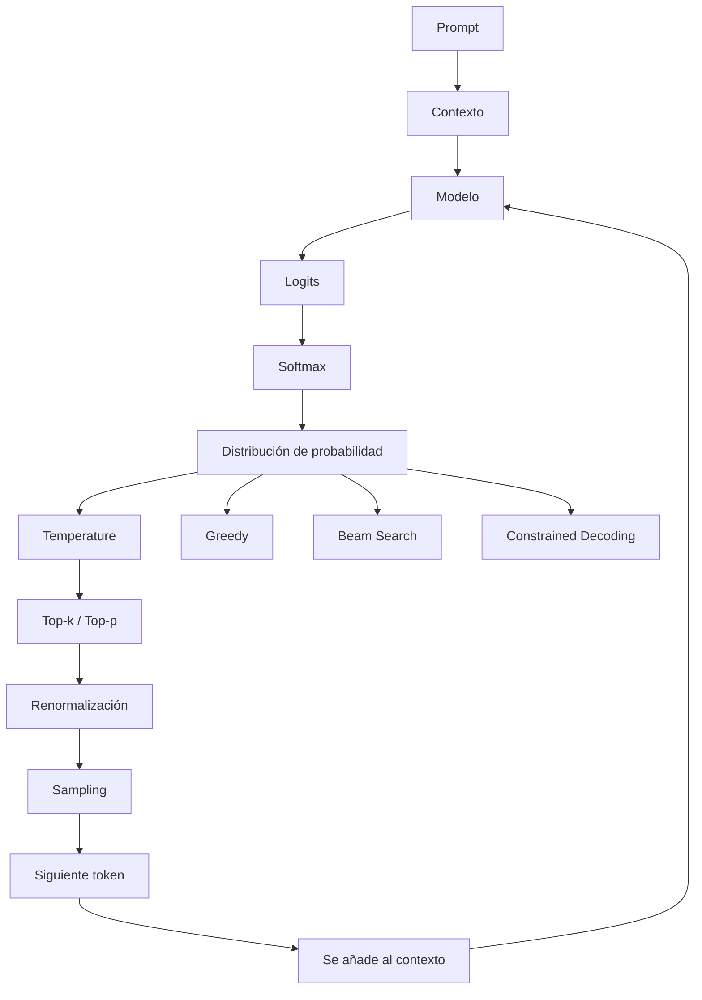

# Sampling: cómo un modelo elige el siguiente token

> **Nivel:** Fundamentos → Avanzado → Maestría/PhD
> **Área:** LLM, inferencia y generación
> **Prerrequisitos:** `07-Pretraining.md`, `10-Alignment.md`, `11-Inference.md`

---

## 1. ¿Qué es Sampling?

**Sampling** significa **muestreo**.

En un modelo generativo, después de procesar el contexto, el modelo no obtiene directamente una frase completa. Obtiene una **distribución de probabilidad sobre los posibles siguientes tokens**.

Por ejemplo, ante:

```text
El cielo es
```

el modelo podría producir aproximadamente:

```text
azul       → 0.62
gris       → 0.14
claro      → 0.08
oscuro     → 0.04
hermoso    → 0.02
...
```

Sampling es el mecanismo mediante el cual el sistema utiliza esa distribución para decidir qué token generar.

Conceptualmente:

```text
PROMPT
   ↓
TOKENS
   ↓
MODELO
   ↓
LOGITS
   ↓
PROBABILIDADES
   ↓
SAMPLING / DECODIFICACIÓN
   ↓
SIGUIENTE TOKEN
   ↓
SE REPITE
```

Por tanto:

> **Sampling ocurre después de que el modelo ha calculado la distribución sobre los posibles siguientes tokens.**

---

# 2. Sampling no es lo mismo que generación

Es importante separar dos conceptos.

### Generación

Es el proceso completo de producir una respuesta:

```text
contexto
→ predicción
→ selección de token
→ añadir token al contexto
→ nueva predicción
→ nueva selección
→ ...
```

### Sampling

Es una parte de ese proceso:

```text
probabilidades
→ selección del siguiente token
```

Por ejemplo:

```text
Generación
│
├── procesamiento del contexto
├── cálculo de logits
├── cálculo de probabilidades
├── sampling / decoding
├── incorporación del token
└── repetición
```

---

# 3. ¿De dónde salen las probabilidades?

El modelo produce primero **logits**.

Supongamos que el vocabulario contiene:

```text
["azul", "rojo", "verde", "gris"]
```

El modelo podría producir:

```text
azul    → 5.2
rojo    → 2.1
verde   → 1.7
gris    → 0.3
```

Estos valores son logits.

Todavía no son probabilidades.

Para convertirlos en probabilidades se utiliza normalmente **softmax**:

$$
P(i)=
\frac{e^{z_i}}
{\sum_j e^{z_j}}
$$

donde:

* \(z_i\) = logit del token \(i\)
* \(P(i)\) = probabilidad del token \(i\)

El resultado podría ser:

```text
azul    → 0.91
rojo    → 0.05
verde   → 0.03
gris    → 0.01
```

Ahora sí tenemos una distribución de probabilidad.

---

# 4. Una distribución de probabilidad

Una distribución puede representarse como:

```text
Token       Probabilidad

azul          91 %
rojo           5 %
verde          3 %
gris           1 %
```

La suma debe ser:

$$
\sum_i P(i)=1
$$

o:

```text
100 %
```

El modelo está diciendo:

> Dados el contexto y los parámetros actuales, estas son las probabilidades relativas de los posibles siguientes tokens.

No está diciendo:

> Esta palabra es definitivamente correcta.

Esta diferencia es fundamental.

---

# 5. El modelo no genera una respuesta completa de una sola vez

Supongamos:

```text
El cielo es
```

El modelo selecciona:

```text
azul
```

Ahora el contexto se convierte en:

```text
El cielo es azul
```

Se vuelve a ejecutar el proceso.

```text
El cielo es azul
        ↓
predicción
        ↓
durante
```

Ahora:

```text
El cielo es azul durante
```

Nueva predicción:

```text
el
```

Y así sucesivamente.

```text
El
 ↓
cielo
 ↓
es
 ↓
azul
 ↓
durante
 ↓
el
 ↓
día
 ↓
...
```

Por eso una respuesta puede entenderse como una **secuencia de decisiones de generación**.

---

# 6. ¿Por qué necesitamos Sampling?

Si siempre seleccionáramos el token con mayor probabilidad, tendríamos una estrategia conocida como:

**Greedy decoding**

Por ejemplo:

```text
azul   → 0.62  ← seleccionado
gris   → 0.20
claro  → 0.10
...
```

Siempre:

```text
seleccionar argmax(P(token))
```

Es decir:

$$
x_t=\arg\max_x P(x|x_{<t})
$$

Esto produce respuestas relativamente deterministas.

Pero puede generar problemas:

* repetición;
* lenguaje poco natural;
* respuestas demasiado predecibles;
* poca diversidad;
* elecciones localmente óptimas que no producen la mejor secuencia global.

Sampling permite explorar diferentes posibilidades de la distribución.

---

# 7. Sampling aleatorio

Imaginemos:

```text
Token       Probabilidad

A              0.50
B              0.30
C              0.15
D              0.05
```

Con sampling probabilístico:

* A tiene mayor posibilidad de ser elegido.
* B puede ser elegido.
* C también.
* D es poco probable, pero no imposible.

No significa:

```text
todos tienen la misma probabilidad
```

Significa:

```text
la probabilidad controla la frecuencia esperada de selección
```

Si repitiéramos el experimento muchas veces, aproximadamente observaríamos:

```text
A ≈ 50 %
B ≈ 30 %
C ≈ 15 %
D ≈ 5 %
```

---

# 8. Sampling no significa generar cualquier cosa

Una confusión frecuente es:

> "Si utilizamos sampling, el modelo empieza a inventar aleatoriamente."

No exactamente.

La aleatoriedad está **condicionada por la distribución producida por el modelo**.

Si tenemos:

```text
A → 0.95
B → 0.03
C → 0.01
D → 0.01
```

el muestreo normalmente elegirá A.

La distribución sigue controlando fuertemente el resultado.

Por eso es mejor pensar:

> **Sampling introduce estocasticidad controlada, no aleatoriedad uniforme.**

---

# 9. Sampling y temperatura

Uno de los mecanismos más importantes para modificar la distribución es la **temperatura**.

La temperatura suele aplicarse sobre los logits antes de softmax:

$$
P(i)=
\frac{e^{z_i/T}}
{\sum_j e^{z_j/T}}
$$

donde:

$$
T>0
$$

es la temperatura.

---

# 10. Temperatura baja

Supongamos:

```text
A → 0.60
B → 0.25
C → 0.10
D → 0.05
```

Una temperatura menor tiende a hacer la distribución más concentrada.

Conceptualmente:

```text
Temperatura baja
        ↓
distribución más concentrada
        ↓
menos diversidad
        ↓
mayor determinismo
```

Por ejemplo:

```text
A → 0.85
B → 0.10
C → 0.04
D → 0.01
```

---

# 11. Temperatura alta

Una temperatura mayor tiende a distribuir más la probabilidad.

Conceptualmente:

```text
Temperatura alta
        ↓
distribución más plana
        ↓
más diversidad
        ↓
más exploración
```

Podríamos obtener algo como:

```text
A → 0.40
B → 0.30
C → 0.20
D → 0.10
```

Los valores anteriores son solamente ilustrativos.

---

# 12. Temperatura no "agrega creatividad"

Es frecuente escuchar:

> "Temperatura alta hace que la IA sea más creativa."

Como explicación pedagógica puede ser útil, pero técnicamente es incompleta.

La temperatura modifica la **distribución de probabilidades utilizada durante la selección**.

Eso puede producir mayor diversidad.

Pero:

```text
temperatura alta
≠
creatividad garantizada
```

Y:

```text
temperatura baja
≠
mayor exactitud garantizada
```

La calidad depende también de:

* modelo;
* prompt;
* datos;
* contexto;
* tarea;
* entrenamiento;
* método de decoding;
* restricciones;
* evaluación.

---

# 13. Temperatura igual a 1

Cuando:

$$
T=1
$$

la transformación de temperatura no modifica los logits:

$$
\frac{z_i}{1}=z_i
$$

Por tanto:

```text
T = 1
```

representa la distribución original antes de aplicar modificaciones adicionales de temperatura.

---

# 14. Temperatura cercana a cero

Conceptualmente, cuando:

$$
T\rightarrow0^+
$$

la distribución se concentra alrededor del token con mayor logit.

Por eso:

```text
T → 0
```

se aproxima al comportamiento de:

```text
argmax
```

Sin embargo, una implementación concreta puede tener restricciones, redondeos o comportamientos específicos.

Por eso no conviene asumir que:

```text
temperature = 0
```

significa exactamente lo mismo en todas las APIs.

---

# 15. Top-k Sampling

La temperatura modifica toda la distribución.

**Top-k** utiliza otra estrategia:

> Mantener solamente los \(k\) tokens con mayor probabilidad.

Supongamos:

```text
A → 0.40
B → 0.25
C → 0.15
D → 0.10
E → 0.06
F → 0.04
```

Si:

```text
k = 3
```

conservamos:

```text
A
B
C
```

y descartamos:

```text
D
E
F
```

Después se renormalizan las probabilidades.

---

# 16. ¿Por qué usar Top-k?

El vocabulario de un LLM puede contener una cantidad enorme de tokens.

Muchos tienen probabilidades extremadamente pequeñas.

Permitir que todos participen puede introducir candidatos poco plausibles.

Top-k limita la selección:

```text
Vocabulario completo
        ↓
ordenar candidatos
        ↓
seleccionar k mejores
        ↓
renormalizar
        ↓
sampling
```

---

# 17. Problema de Top-k

Un valor fijo de \(k\) no siempre es adecuado.

Consideremos dos situaciones.

### Caso A

```text
A → 0.90
B → 0.04
C → 0.02
D → 0.01
...
```

Aquí hay una opción claramente dominante.

### Caso B

```text
A → 0.25
B → 0.23
C → 0.20
D → 0.17
E → 0.15
```

Aquí existen varias alternativas razonables.

Un \(k\) fijo no considera directamente la forma de la distribución.

Esto motiva otros métodos.

---

# 18. Top-p Sampling

**Top-p**, también llamado **nucleus sampling**, selecciona el conjunto mínimo de tokens cuya probabilidad acumulada alcanza un umbral \(p\).

Supongamos:

```text
A → 0.50
B → 0.25
C → 0.12
D → 0.08
E → 0.03
F → 0.02
```

Si:

$$
p=0.90
$$

acumulamos:

```text
A → 0.50
A+B → 0.75
A+B+C → 0.87
A+B+C+D → 0.95
```

Por tanto, el conjunto sería:

```text
A
B
C
D
```

porque es el conjunto mínimo que supera 0.90.

Después se renormalizan las probabilidades y se realiza sampling.

---

# 19. Top-k frente a Top-p

La diferencia fundamental es:

| Método      | Regla                                                            |
| ----------- | ---------------------------------------------------------------- |
| Greedy      | seleccionar el token más probable                                |
| Top-k       | conservar exactamente los \(k\) candidatos principales           |
| Top-p       | conservar candidatos hasta alcanzar probabilidad acumulada \(p\) |
| Sampling    | seleccionar según una distribución                               |
| Temperature | modificar la concentración de la distribución                    |

Visualmente:

```text
GREEDY
   ↓
1 candidato


TOP-K
   ↓
k candidatos


TOP-P
   ↓
cantidad variable de candidatos


SAMPLING
   ↓
selección probabilística
```

---

# 20. Top-k y Top-p pueden combinarse

En algunos sistemas se pueden aplicar simultáneamente.

Por ejemplo:

```text
Logits
  ↓
Temperature
  ↓
Top-k
  ↓
Top-p
  ↓
Renormalización
  ↓
Sampling
```

Pero el orden exacto y los parámetros disponibles dependen de la implementación.

No todos los proveedores exponen todos estos controles.

---

# 21. Renormalización

Cuando eliminamos tokens debemos volver a normalizar las probabilidades.

Supongamos:

```text
A → 0.50
B → 0.30
C → 0.20
```

Aplicamos:

```text
Top-k = 2
```

Eliminamos C.

Queda:

```text
A → 0.50
B → 0.30
```

La suma es:

```text
0.80
```

Debemos renormalizar:

$$
P'(A)=\frac{0.50}{0.80}=0.625
$$

$$
P'(B)=\frac{0.30}{0.80}=0.375
$$

Resultado:

```text
A → 62.5 %
B → 37.5 %
```

Ahora vuelven a sumar:

```text
100 %
```

---

# 22. Logits, temperatura y sampling

Es útil visualizar todo el proceso:

```text
              MODELO
                │
                ↓
             LOGITS
                │
                ↓
          TEMPERATURA
                │
                ↓
             SOFTMAX
                │
                ↓
         PROBABILIDADES
                │
        ┌───────┴───────┐
        ↓               ↓
      TOP-K            TOP-P
        │               │
        └───────┬───────┘
                ↓
         RENORMALIZACIÓN
                ↓
             SAMPLING
                ↓
          SIGUIENTE TOKEN
```

En una implementación concreta, algunos pasos pueden combinarse o realizarse en otro orden.

---

# 23. Seed y reproducibilidad

La generación puede utilizar números pseudoaleatorios.

Una **seed** permite inicializar el generador aleatorio.

Conceptualmente:

```text
mismo modelo
+
mismo contexto
+
mismos parámetros
+
misma seed
```

puede permitir reproducir una secuencia.

Pero esto no garantiza reproducibilidad absoluta en todos los sistemas.

También pueden intervenir:

* kernels de GPU;
* paralelismo;
* cuantización;
* versiones del modelo;
* infraestructura;
* operaciones no deterministas;
* cambios del proveedor;
* herramientas externas.

Por eso:

> **Una seed no equivale automáticamente a reproducibilidad perfecta de extremo a extremo.**

---

# 24. Sampling y determinismo

Podemos visualizar un espectro:

```text
MÁS DETERMINISTA
        │
        ↓
Greedy
        ↓
Temperatura muy baja
        ↓
Sampling restringido
        ↓
Sampling más amplio
        ↓
Temperatura mayor
        │
        ↓
MÁS DIVERSIDAD
```

Esto no debe interpretarse como una escala universal de calidad.

Es una escala conceptual de **variabilidad de generación**.

---

# 25. Sampling durante una respuesta completa

Supongamos:

```text
Prompt:

Explica qué es Python.
```

El modelo podría producir:

```text
Python
```

Después:

```text
Python es
```

Después:

```text
Python es un
```

Después:

```text
Python es un lenguaje
```

Cada paso requiere una nueva predicción.

Por tanto:

```text
t1 → token 1
t2 → token 2
t3 → token 3
t4 → token 4
...
```

En cada posición existe una nueva distribución:

$$
P(x_t|x_{<t})
$$

La respuesta completa puede expresarse como:

$$
P(x_1,x_2,\ldots,x_T)
=
\prod_{t=1}^{T}
P(x_t|x_{<t})
$$

Esta ecuación es fundamental para comprender la generación autoregresiva.

---

# 26. Sampling y probabilidad de una secuencia

Supongamos:

```text
Token 1 → 0.8
Token 2 → 0.6
Token 3 → 0.5
```

La probabilidad conjunta de esa secuencia sería:

$$
0.8\times0.6\times0.5=0.24
$$

Por tanto:

```text
24 %
```

Este ejemplo es simplificado.

En un LLM real, cada distribución depende de todo el contexto disponible.

---

# 27. El efecto acumulativo

Una pequeña diferencia en un token puede cambiar el contexto posterior.

Por ejemplo:

```text
Ruta A:

El estudiante decidió estudiar
        ↓
matemáticas
        ↓
porque...
```

Otra posibilidad:

```text
Ruta B:

El estudiante decidió estudiar
        ↓
programación
        ↓
porque...
```

A partir de ahí, el modelo recibe contextos diferentes.

Por tanto:

```text
pequeña diferencia inicial
        ↓
contexto diferente
        ↓
distribución diferente
        ↓
nuevas elecciones
        ↓
respuesta diferente
```

Esto explica por qué dos generaciones pueden divergir rápidamente.

---

# 28. Sampling y prompt engineering

Aquí aparece una relación importante con la Ingeniería de Prompt.

Un prompt no controla directamente qué token será seleccionado.

Modifica el **contexto de entrada** que el modelo utiliza para producir la distribución.

Conceptualmente:

```text
PROMPT
   ↓
CONTEXTO
   ↓
REPRESENTACIONES INTERNAS
   ↓
LOGITS
   ↓
PROBABILIDADES
   ↓
SAMPLING
   ↓
TOKEN
```

Por eso:

> Un buen prompt no "ordena" físicamente al modelo qué token debe producir. Modifica las condiciones bajo las cuales el modelo calcula la distribución.

---

# 29. Ejemplo de prompt

Consideremos:

```text
Resume este documento.
```

El modelo tiene muchas posibilidades de respuesta.

Ahora añadimos:

```text
Resume este documento en exactamente 5 viñetas.
No agregues información que no aparezca en el documento.
```

El contexto adicional modifica la distribución.

Conceptualmente:

```text
Prompt A
   ↓
distribución A


Prompt B
   ↓
distribución B
```

Por tanto:

```text
Prompt diferente
→ logits diferentes
→ probabilidades diferentes
→ sampling diferente
→ salida diferente
```

---

# 30. Sampling no corrige un modelo deficiente

Un error común es intentar resolver problemas de calidad únicamente modificando:

```text
temperature
top-k
top-p
```

Pero si el problema está en:

* información ausente;
* contexto incorrecto;
* modelo inadecuado;
* datos deficientes;
* instrucciones ambiguas;
* arquitectura;
* herramientas;
* recuperación RAG;

el sampling no necesariamente lo solucionará.

Ejemplo:

```text
Documento no contiene el dato
        ↓
LLM intenta responder
        ↓
sampling
        ↓
elige entre candidatos
```

Cambiar la temperatura no introduce mágicamente el dato correcto.

---

# 31. Sampling frente a conocimiento

Es importante separar:

```text
CONOCIMIENTO / INFORMACIÓN
```

de:

```text
MECANISMO DE SELECCIÓN
```

Sampling responde aproximadamente a:

> ¿Cuál de los candidatos disponibles se seleccionará?

No responde:

> ¿De dónde salió la información?

La información puede proceder de:

* parámetros del modelo;
* contexto;
* documentos recuperados;
* herramientas;
* memoria del sistema;
* instrucciones.

---

# 32. Sampling en sistemas RAG

En un sistema RAG:

```text
Pregunta
   ↓
Embedding
   ↓
Búsqueda
   ↓
Documentos
   ↓
Contexto
   ↓
LLM
   ↓
Logits
   ↓
Sampling
   ↓
Respuesta
```

El RAG modifica el contexto disponible.

El sampling determina cómo se genera la respuesta a partir de esa situación.

Por eso:

```text
RAG ≠ Sampling
```

Son componentes diferentes.

---

# 33. Sampling y salidas estructuradas

Supongamos que necesitamos:

```json
{
  "riesgo": "ALTO",
  "monto": 15000
}
```

En un sistema con **Structured Outputs** o restricciones de decodificación, el sistema puede restringir qué tokens son válidos en determinadas posiciones.

Conceptualmente:

```text
Modelo
   ↓
probabilidades
   ↓
restricciones del esquema
   ↓
tokens válidos
   ↓
selección
```

Esto es diferente de simplemente decir:

```text
"Devuelve JSON."
```

mediante un prompt.

La instrucción textual influye sobre el comportamiento del modelo, mientras que una restricción de decodificación puede actuar sobre el espacio de salida permitido.

---

# 34. Constrained Decoding

**Constrained decoding** significa generar respetando restricciones.

Por ejemplo:

```text
{
  "nombre": "...",
  "edad": número
}
```

El sistema puede impedir determinadas continuaciones inválidas.

Esto es especialmente útil para:

* JSON;
* gramáticas;
* lenguajes formales;
* SQL;
* código;
* protocolos;
* llamadas a herramientas.

Conceptualmente:

```text
Distribución del modelo
        ↓
restricciones
        ↓
espacio permitido
        ↓
decodificación
```

---

# 35. Sampling y Tool Calling

Cuando un LLM decide utilizar una herramienta:

```text
Usuario
  ↓
Modelo
  ↓
tool call
  ↓
herramienta
  ↓
resultado
  ↓
modelo
  ↓
respuesta
```

La selección de una herramienta puede formar parte de la generación estructurada.

Por ejemplo:

```json
{
  "tool": "buscar_cliente",
  "arguments": {
    "id": "1234"
  }
}
```

El sistema puede combinar:

```text
modelo
+
esquema
+
restricciones
+
decodificación
```

Esto demuestra nuevamente que:

> La salida final no depende exclusivamente del sampling libre.

---

# 36. Beam Search

Existe otra familia de estrategias denominada **beam search**.

En lugar de mantener solamente una secuencia, conserva varias hipótesis parciales.

Conceptualmente:

```text
Inicio
  │
  ├── A
  │    ├── A1
  │    └── A2
  │
  ├── B
  │    ├── B1
  │    └── B2
  │
  └── C
       ├── C1
       └── C2
```

Se mantienen las secuencias con mejores puntuaciones.

Beam search fue muy utilizado en sistemas de generación anteriores, especialmente en:

* traducción automática;
* reconocimiento de voz;
* generación secuencial.

En LLM conversacionales modernos, su papel es mucho más específico y no debe asumirse como el método estándar de generación.

---

# 37. Greedy frente a Beam Search

### Greedy

Elige:

```text
mejor token actual
```

y continúa.

### Beam Search

Mantiene:

```text
varias secuencias candidatas
```

y las compara.

Conceptualmente:

```text
Greedy:

A → A1 → A1a → A1a...


Beam:

A ─→ A1
  └→ A2

B ─→ B1
  └→ B2

C ─→ C1
  └→ C2
```

Beam search intenta reducir el problema de tomar decisiones demasiado miopes.

---

# 38. Decoding no es exactamente lo mismo que Sampling

En literatura técnica, **decoding** puede utilizarse como término general para describir cómo se obtiene una secuencia a partir de las distribuciones del modelo.

Dentro de ese espacio encontramos estrategias como:

```text
Greedy decoding
Beam search
Sampling
Top-k sampling
Top-p sampling
Temperature sampling
Constrained decoding
```

Por eso:

```text
Decoding
└── Sampling
```

es una forma útil de organizar conceptualmente los métodos, aunque la terminología puede variar según el contexto.

---

# 39. Entropía

Para comprender Sampling a nivel avanzado necesitamos introducir la **entropía**.

La entropía de una distribución discreta es:

$$
H(P)
=
-\sum_i P(i)\log P(i)
$$

La entropía mide, de forma general, cuánta incertidumbre existe en la distribución.

### Distribución concentrada

```text
A → 0.99
B → 0.01
```

Tiene baja entropía.

### Distribución uniforme

```text
A → 0.25
B → 0.25
C → 0.25
D → 0.25
```

Tiene mayor entropía.

Conceptualmente:

```text
BAJA ENTROPÍA
→ una opción domina


ALTA ENTROPÍA
→ varias opciones compiten
```

---

# 40. Temperatura y entropía

La temperatura puede modificar la entropía de la distribución.

Generalmente:

```text
T baja
→ distribución más concentrada
→ menor entropía


T alta
→ distribución más plana
→ mayor entropía
```

Esto proporciona una interpretación más rigurosa de la idea de:

```text
"más determinista"
```

frente a:

```text
"más diverso"
```

---

# 41. Entropía no significa calidad

Una distribución de alta entropía no es necesariamente mejor.

Y una distribución de baja entropía no es necesariamente peor.

Por ejemplo:

```text
Pregunta matemática simple
→ respuesta claramente determinada
→ baja entropía puede ser apropiada
```

Mientras que:

```text
Escribe cinco ideas creativas
→ múltiples respuestas válidas
→ mayor diversidad puede ser útil
```

La configuración adecuada depende de la tarea.

---

# 42. Perplexity y sampling

La **perplejidad (perplexity)** está relacionada con la incertidumbre del modelo.

Una definición común es:

$$
PPL=e^H
$$

cuando \(H\) representa la entropía promedio correspondiente.

Otra formulación habitual en lenguaje es:

$$
PPL =
\exp
\left(
-\frac{1}{T}
\sum_{t=1}^{T}
\log P(x_t|x_{<t})
\right)
$$

La perplejidad se utiliza principalmente para evaluar modelos de lenguaje y no debe confundirse con:

```text
temperature
```

ni con:

```text
sampling
```

---

# 43. Log-probabilities

Algunos sistemas permiten obtener **logprobs**, es decir, logaritmos de probabilidades.

Si:

$$
P(token)=0.8
$$

entonces:

$$
\log P(token)
$$

será un número negativo.

Los log-probabilities son útiles para:

* analizar incertidumbre;
* comparar candidatos;
* estudiar generación;
* evaluar clasificación basada en likelihood;
* investigar comportamiento del modelo.

---

# 44. ¿Por qué trabajar con logaritmos?

Una secuencia puede tener probabilidades extremadamente pequeñas.

Supongamos:

$$
0.8\times0.7\times0.6\times0.5
$$

En secuencias largas, multiplicar muchas probabilidades puede producir números muy pequeños.

Los logaritmos convierten multiplicaciones en sumas:

$$
\log(ab)=\log(a)+\log(b)
$$

Por eso:

$$
\log P(x_1,\ldots,x_T)
=
\sum_t \log P(x_t|x_{<t})
$$

Esto es numéricamente y computacionalmente conveniente.

---

# 45. Sampling y alucinaciones

Es incorrecto afirmar:

> "Las alucinaciones son causadas por temperatura."

La relación es más compleja.

Una temperatura alta puede aumentar la diversidad de generación, pero las alucinaciones también dependen de:

* conocimiento del modelo;
* datos de entrenamiento;
* contexto;
* recuperación;
* instrucciones;
* incertidumbre;
* arquitectura;
* herramientas;
* método de evaluación.

Por tanto:

```text
Temperatura
≠
causa única de alucinación
```

---

# 46. Sampling en tareas deterministas

Para tareas como:

* extracción estructurada;
* clasificación;
* cálculo;
* transformación de datos;
* generación de código bajo restricciones;
* auditoría documental;

puede ser importante reducir la variabilidad.

Pero incluso aquí:

```text
temperature baja
```

no garantiza:

```text
respuesta correcta
```

La determinación y la corrección son propiedades diferentes.

---

# 47. Ejemplo aplicado: auditoría con IA

Supongamos un sistema que analiza:

```text
Libro Mayor
```

y debe detectar:

```text
duplicados
anomalías
errores de secuencia
riesgos
```

Tenemos dos escenarios.

### Configuración A

```text
temperatura baja
```

La salida puede ser más consistente.

### Configuración B

```text
temperatura mayor
```

La salida puede presentar mayor variabilidad.

Pero si el sistema necesita:

```json
{
  "cuenta": "...",
  "riesgo": "...",
  "monto": 0,
  "desc": "..."
}
```

la solución profesional no consiste únicamente en modificar temperatura.

También debemos controlar:

```text
prompt
+
contexto
+
esquema
+
validación
+
reglas
+
modelo
+
sampling
+
evaluación
```

---

# 48. Sampling dentro de un sistema de IA

Una arquitectura real puede verse así:

```text
                 USUARIO
                    │
                    ↓
                  PROMPT
                    │
                    ↓
             ORQUESTADOR
                    │
          ┌─────────┴─────────┐
          ↓                   ↓
       CONTEXTO             TOOLS
          │                   │
          └─────────┬─────────┘
                    ↓
                  MODELO
                    │
                    ↓
                  LOGITS
                    │
                    ↓
              DECODIFICACIÓN
                    │
          ┌─────────┴─────────┐
          ↓                   ↓
       SAMPLING           CONSTRAINTS
          │                   │
          └─────────┬─────────┘
                    ↓
                  TOKEN
                    │
                    ↓
              NUEVO CONTEXTO
                    │
                    ↓
                REPETICIÓN
```

Esto conecta directamente Sampling con la **Ingeniería de Sistemas de IA**.

---

# 49. Una visión más profunda: Sampling como proceso estocástico

Desde una perspectiva matemática, la generación autoregresiva puede verse como una secuencia de variables aleatorias:

$$
X_1,X_2,\ldots,X_T
$$

donde:

$$
X_t \sim P_\theta(X_t|X_{<t})
$$

El modelo define una distribución condicionada por los tokens anteriores.

Por tanto:

```text
X1
 ↓
X2 | X1
 ↓
X3 | X1,X2
 ↓
X4 | X1,X2,X3
 ↓
...
```

La generación completa es un proceso secuencial.

---

# 50. Sampling y cadena de decisiones

Podemos representarlo como:

```text
Contexto inicial
      ↓
Distribución P(X1)
      ↓
Sample X1
      ↓
Distribución P(X2 | X1)
      ↓
Sample X2
      ↓
Distribución P(X3 | X1,X2)
      ↓
Sample X3
      ↓
...
```

Esto explica una propiedad fundamental de los LLM:

> **Una respuesta generada es una trayectoria concreta dentro de un espacio probabilístico de posibles secuencias.**

---

# 51. Sampling y distribución del modelo

El modelo no genera directamente:

```text
"una respuesta correcta"
```

Produce una distribución condicionada:

$$
P(token|contexto)
$$

El sistema de generación convierte esa distribución en una secuencia concreta.

Por eso podemos separar:

```text
MODELO
→ estima distribución


DECODIFICADOR
→ transforma distribución en secuencia
```

Esta separación es fundamental en investigación y sistemas de IA.

---

# 52. Sampling no cambia los parámetros

Este punto conecta con los capítulos anteriores.

Durante inferencia:

```text
Prompt
   ↓
Modelo
   ↓
Logits
   ↓
Sampling
   ↓
Respuesta
```

Sampling normalmente no modifica:

```text
pesos
parámetros
arquitectura
```

Modificar:

```text
temperature
top-p
top-k
```

no equivale a entrenar nuevamente el modelo.

Por tanto:

```text
Sampling
≠
Fine-tuning
```

---

# 53. Sampling frente a Fine-Tuning

### Fine-tuning

Modifica:

```text
parámetros del modelo
```

### Sampling

Modifica:

```text
cómo se seleccionan tokens durante la inferencia
```

Podemos resumir:

```text
FINE-TUNING
→ cambia el modelo


PROMPT
→ cambia el contexto


SAMPLING
→ cambia la selección durante la generación
```

Esta distinción será fundamental para Ingeniería de Prompt avanzada.

---

# 54. Sampling frente a Alignment

El alignment puede modificar el comportamiento del modelo durante el entrenamiento/post-training.

Sampling opera durante inferencia.

```text
PRETRAINING
      ↓
INSTRUCTION TUNING
      ↓
ALIGNMENT / POST-TRAINING
      ↓
MODELO
      │
      ↓
   INFERENCIA
      │
      ↓
   SAMPLING
```

Por tanto:

```text
Alignment
≠
Sampling
```

Aunque ambos influyen en el comportamiento observable.

---

# 55. Sampling y seguridad

Sampling también tiene implicaciones de seguridad.

Una distribución más abierta puede aumentar la diversidad de respuestas.

Pero una respuesta de seguridad no debería depender exclusivamente de:

```text
temperature
```

Los sistemas robustos utilizan múltiples capas:

```text
modelo
+
instrucciones
+
políticas
+
clasificadores
+
restricciones
+
validación
+
tool permissions
+
monitorización
```

La seguridad es un problema de sistema, no simplemente un parámetro de sampling.

---

# 56. Sampling en agentes

En un agente:

```text
Objetivo
   ↓
LLM
   ↓
acción
   ↓
herramienta
   ↓
resultado
   ↓
LLM
   ↓
siguiente acción
```

El sampling puede influir en la selección de:

```text
respuesta
herramienta
argumentos
siguiente paso
```

Una pequeña variación puede cambiar la trayectoria del agente.

Por eso los sistemas agentivos suelen necesitar:

* validación;
* permisos;
* límites;
* estados;
* políticas;
* observabilidad;
* intervención humana cuando corresponde.

---

# 57. ¿Qué parámetros debería utilizar?

No existe una combinación universal.

Una forma conceptual de pensar la configuración es:

| Tipo de tarea      | Objetivo principal          | Estrategia conceptual                  |
| ------------------ | --------------------------- | -------------------------------------- |
| Extracción         | Consistencia                | Baja variabilidad + restricciones      |
| Clasificación      | Estabilidad                 | Decodificación controlada              |
| Código             | Precisión estructural       | Restricciones + validación             |
| Resumen            | Fidelidad                   | Contexto + controles de salida         |
| Escritura creativa | Diversidad                  | Sampling más abierto                   |
| Brainstorming      | Exploración                 | Mayor diversidad                       |
| Auditoría          | Consistencia + trazabilidad | Baja variabilidad + validación         |
| Agentes            | Control de acciones         | Decodificación + permisos + validación |

Estos son principios de diseño, no valores universales de parámetros.

---

# 58. Error frecuente: "temperature = 0 significa verdad"

No.

```text
temperature = 0
```

no significa:

```text
100 % correcto
```

Significa, conceptualmente:

```text
menos variabilidad en la selección
```

Un modelo puede producir una respuesta incorrecta de manera extremadamente consistente.

Ejemplo:

```text
Pregunta incorrecta
        ↓
modelo
        ↓
respuesta incorrecta
        ↓
temperature baja
        ↓
misma respuesta incorrecta
```

---

# 59. Error frecuente: "top-p alto hace al modelo más inteligente"

Tampoco.

Top-p controla el conjunto de candidatos disponibles para el sampling.

No aumenta:

```text
parámetros
```

ni:

```text
capacidad de razonamiento
```

ni:

```text
conocimiento
```

Es un mecanismo de generación.

---

# 60. Error frecuente: "más aleatoriedad = más creatividad"

No necesariamente.

Una distribución demasiado abierta puede producir:

```text
diversidad
+
inconsistencia
+
errores
```

La creatividad útil requiere también:

```text
coherencia
+
relevancia
+
restricciones
+
objetivo
```

---

# 61. Sampling y evaluación

Un sistema profesional no debería evaluarse con una única generación.

Si el sistema es estocástico:

```text
Prompt
 ↓
Respuesta A

Prompt
 ↓
Respuesta B

Prompt
 ↓
Respuesta C
```

pueden existir diferencias.

Por ello se pueden estudiar:

* media de desempeño;
* varianza;
* tasa de error;
* consistencia;
* robustez;
* distribución de resultados.

Una evaluación más rigurosa puede ejecutar múltiples muestras.

---

# 62. Ejemplo de evaluación

Supongamos que evaluamos 100 casos.

Con una configuración:

```text
100 ejecuciones
→ 92 correctas
→ 8 incorrectas
```

Otra configuración:

```text
100 ejecuciones
→ 88 correctas
→ 12 incorrectas
```

No basta con observar una sola respuesta y concluir cuál configuración es mejor.

En sistemas estocásticos:

```text
resultado individual
≠
comportamiento estadístico del sistema
```

---

# 63. Sampling y benchmark

Un benchmark de LLM debe controlar, cuando sea relevante:

```text
modelo
versión
prompt
dataset
temperatura
sampling
seed
criterio de evaluación
herramientas
contexto
```

De lo contrario, comparar resultados puede ser engañoso.

Esto es especialmente importante en:

* investigación;
* evaluación empresarial;
* pruebas A/B;
* red teaming;
* benchmarking de modelos.

---

# 64. Nivel avanzado: distribución truncada

Top-k y Top-p pueden entenderse como mecanismos de **truncamiento de la distribución**.

Partimos de:

$$
P(x|c)
$$

y construimos una distribución restringida:

$$
P'(x|c)
$$

sobre un subconjunto:

$$
S\subseteq V
$$

donde \(V\) es el vocabulario.

Después:

$$
P'(x|c)
=
\frac{P(x|c)}
{\sum_{y\in S}P(y|c)}
$$

para:

$$
x\in S
$$

y:

$$
P'(x|c)=0
$$

para:

$$
x\notin S
$$

Esta formulación permite comprender Top-k y Top-p desde una perspectiva matemática.

---

# 65. Nivel avanzado: temperature como transformación de energía

Los logits pueden interpretarse, en ciertos marcos probabilísticos, como relacionados con una función de energía.

La distribución con temperatura puede expresarse como:

$$
P_i(T)
=
\frac{e^{z_i/T}}
{\sum_j e^{z_j/T}}
$$

Cuando:

$$
T\rightarrow0^+
$$

la masa se concentra en los máximos.

Cuando:

$$
T\rightarrow\infty
$$

la distribución tiende hacia una distribución más uniforme, bajo condiciones estándar.

Esto proporciona una interpretación matemática de temperatura como parámetro de concentración.

---

# 66. Nivel de Maestría: exposición de la distribución

La distribución completa contiene información mucho más rica que solamente:

```text
token elegido
```

Por ejemplo:

```text
A → 0.51
B → 0.48
C → 0.01
```

y:

```text
A → 0.98
B → 0.01
C → 0.01
```

pueden producir:

```text
A
```

pero representan situaciones de incertidumbre muy diferentes.

Por eso, cuando una API expone logprobs, pueden estudiarse características de la distribución que normalmente quedan ocultas.

---

# 67. Nivel de Maestría: incertidumbre epistémica vs aleatoriedad

Hay que distinguir:

### Incertidumbre de la distribución

El modelo asigna probabilidad a múltiples candidatos.

### Aleatoriedad de la selección

El mecanismo de sampling puede seleccionar diferentes candidatos.

No son exactamente lo mismo.

Podemos tener:

```text
Alta incertidumbre
+
decodificación greedy
```

y obtener siempre:

```text
A
```

aunque:

```text
A = 0.35
B = 0.34
C = 0.31
```

Por eso:

> El determinismo de la salida no implica necesariamente alta confianza interna del modelo.

---

# 68. Nivel de Maestría: exposure bias

En modelos autoregresivos aparece un problema conocido como **exposure bias**.

Durante entrenamiento, el modelo suele aprender condicionado por tokens de referencia.

Durante generación, en cambio, recibe sus propios tokens generados.

```text
ENTRENAMIENTO

token correcto
→ siguiente predicción
→ token correcto
→ siguiente predicción


INFERENCIA

token generado
→ siguiente predicción
→ token generado
→ siguiente predicción
```

Un error temprano puede modificar el contexto y afectar las predicciones posteriores.

Esto conecta directamente con el carácter secuencial del sampling.

---

# 69. Nivel de Maestría: búsqueda vs muestreo

Podemos visualizar dos filosofías:

```text
BÚSQUEDA
→ explorar candidatos
→ mantener hipótesis
→ seleccionar secuencias según una función


MUESTREO
→ representar la distribución
→ seleccionar estocásticamente
```

Ninguna estrategia es universalmente superior.

Depende de:

* objetivo;
* función de pérdida;
* tarea;
* estructura de salida;
* coste computacional;
* tolerancia a variabilidad.

---

# 70. Nivel PhD: Sampling como interfaz entre distribución y comportamiento

Desde una perspectiva de investigación, Sampling es interesante porque constituye una interfaz entre:

```text
distribución interna del modelo
```

y:

```text
comportamiento observable
```

Podemos expresarlo como:

$$
P_\theta(x_t|x_{<t})
$$

seguido de una política de decodificación:

$$
\pi(x_t|P_\theta)
$$

La salida observable depende entonces de ambos componentes:

$$
\text{Comportamiento}
=
f(
P_\theta,
\text{decoding}
)
$$

Esto implica que dos sistemas con el mismo modelo pueden producir comportamientos diferentes si utilizan diferentes estrategias de decodificación.

---

# 71. Nivel PhD: el modelo y el decodificador como sistema compuesto

Una arquitectura conceptual más completa es:

```text
                 MODELO
                   │
                   ↓
        Distribución Pθ(x | c)
                   │
                   ↓
              DECODIFICADOR
                   │
        ┌──────────┼──────────┐
        ↓          ↓          ↓
     Greedy      Top-p      Beam
        │          │          │
        └──────────┼──────────┘
                   ↓
                SECUENCIA
```

Por tanto, estudiar solamente los pesos del modelo no siempre explica completamente el comportamiento del sistema desplegado.

---

# 72. Relación con Ingeniería de Prompt

Llegamos a una conclusión importante para este repositorio.

El prompt afecta:

```text
contexto
```

El modelo transforma ese contexto en:

```text
distribución
```

El sampling transforma esa distribución en:

```text
tokens concretos
```

Por tanto:

```text
PROMPT
   ↓
CONTEXTO
   ↓
MODELO
   ↓
LOGITS
   ↓
PROBABILIDADES
   ↓
DECODIFICACIÓN / SAMPLING
   ↓
TOKEN
   ↓
NUEVO CONTEXTO
   ↓
REPETICIÓN
```

Esta es una de las conexiones más importantes entre:

**Prompt Engineering**

y:

**Machine Learning / LLM Inference.**

---

# 73. Mapa conceptual completo



---

# 74. Tabla de conceptos fundamentales

| Concepto             | Función                                                  |
| -------------------- | -------------------------------------------------------- |
| Logit                | puntuación previa a la probabilidad                      |
| Softmax              | transforma logits en distribución                        |
| Probabilidad         | representa la masa asignada a cada candidato             |
| Sampling             | selecciona un candidato de forma probabilística          |
| Greedy               | selecciona el candidato de mayor probabilidad            |
| Temperature          | modifica la concentración de la distribución             |
| Top-k                | limita a los \(k\) candidatos principales                |
| Top-p                | limita al conjunto que acumula probabilidad \(p\)        |
| Renormalización      | vuelve a hacer que las probabilidades sumen 1            |
| Seed                 | controla la inicialización del generador pseudoaleatorio |
| Beam Search          | mantiene múltiples hipótesis de secuencia                |
| Constrained Decoding | restringe las salidas permitidas                         |
| Logprob              | logaritmo de la probabilidad                             |
| Entropía             | mide incertidumbre de una distribución                   |
| Perplexity           | medida relacionada con incertidumbre predictiva          |

---

# 75. Errores conceptuales que debes evitar

### Error 1

> Sampling es aleatoriedad pura.

Incorrecto.

Es muestreo condicionado por una distribución.

---

### Error 2

> Temperature cambia el conocimiento del modelo.

Incorrecto.

Modifica la distribución utilizada durante la generación.

---

### Error 3

> Temperature baja garantiza precisión.

Incorrecto.

Reduce variabilidad, no garantiza verdad.

---

### Error 4

> Top-p siempre es mejor que Top-k.

Incorrecto.

Son estrategias diferentes.

---

### Error 5

> Sampling ocurre antes del modelo.

Incorrecto.

Conceptualmente ocurre después de obtener una distribución de salida.

---

### Error 6

> El prompt determina directamente el token.

Simplificación incorrecta.

El prompt modifica el contexto que condiciona la distribución.

---

### Error 7

> Cambiar sampling equivale a cambiar el modelo.

Incorrecto.

Cambiar parámetros de generación no es fine-tuning.

---

# 76. Resumen

El proceso fundamental puede resumirse así:

```text
1. El usuario proporciona un prompt.

2. El sistema construye el contexto.

3. El modelo procesa el contexto.

4. El modelo produce logits.

5. Los logits se convierten en probabilidades.

6. La estrategia de decoding modifica o restringe la distribución.

7. Sampling selecciona un token.

8. El token se incorpora al contexto.

9. El proceso se repite.
```

La ecuación fundamental de la generación autoregresiva es:

$$
x_t\sim P_\theta(x_t|x_{<t})
$$

y la generación completa puede representarse como:

$$
P(x_{1:T})
=
\prod_{t=1}^{T}
P(x_t|x_{<t})
$$

---

# 77. La idea que debes conservar

Si solamente recuerdas una cosa de este capítulo, recuerda esto:

> **El modelo produce probabilidades; el mecanismo de decoding determina cómo esas probabilidades se convierten en una secuencia concreta de tokens.**

Y, desde Ingeniería de Prompt:

> **El prompt modifica el contexto que produce la distribución; Sampling modifica cómo esa distribución se convierte en la salida observable.**

La cadena completa es:

```text
PROMPT
   ↓
CONTEXTO
   ↓
MODELO
   ↓
LOGITS
   ↓
PROBABILIDADES
   ↓
DECODING
   ↓
SAMPLING
   ↓
TOKEN
   ↓
NUEVO CONTEXTO
   ↓
REPETIR
```

Esta cadena explica por qué dos respuestas distintas pueden aparecer ante el mismo prompt y por qué cambiar únicamente los parámetros de generación puede modificar el comportamiento sin modificar los pesos del modelo.

---

# 78. Conexión con el siguiente capítulo

Después de comprender Sampling, ya podemos separar claramente tres niveles:

```text
¿QUÉ APRENDIÓ EL MODELO?
        ↓
ENTRENAMIENTO


¿QUÉ INFORMACIÓN RECIBE?
        ↓
CONTEXTO + PROMPT


¿CÓMO CONVIERTE LA DISTRIBUCIÓN EN UNA RESPUESTA?
        ↓
INFERENCIA + DECODING + SAMPLING
```

El siguiente paso natural es estudiar cómo estas piezas interactúan con **la arquitectura completa de un sistema LLM**, incluyendo contexto, KV cache, batching, latencia, throughput, memoria, cuantización y optimización de inferencia.

---

## Resumen de una página

```text
SAMPLING
│
├── Parte de la generación autoregresiva
│
├── El modelo produce logits
│
├── Softmax produce probabilidades
│
├── Decoding transforma distribución → secuencia
│
├── Greedy
│   └── elige el máximo
│
├── Temperature
│   ├── baja → más concentración
│   └── alta → más diversidad
│
├── Top-k
│   └── conserva k candidatos
│
├── Top-p
│   └── conserva candidatos hasta probabilidad p
│
├── Sampling
│   └── selección probabilística
│
├── Constrained decoding
│   └── restringe salidas válidas
│
├── Seed
│   └── ayuda a reproducibilidad
│
└── Concepto central
    └── distribución → token
```

**Fórmula clave:**

$$
P(x_t|x_{<t})
$$

**Idea clave:**

```text
El modelo predice una distribución.
El decoding decide cómo utilizarla.
El sampling selecciona tokens.
La generación repite el proceso.
```
