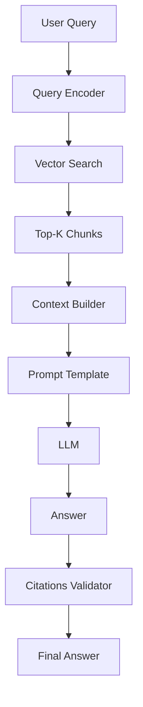

# 09. Aplicaciones Profesionales y Plantillas

Este módulo cierra la brecha entre teoría y práctica profesional. Aquí transformas los fundamentos, técnicas y arquitectura en **sistemas deployables** que resuelven problemas reales.

---

## 9.1 Frameworks Canónicos para Casos Reales

### CO-STAR: Para Tareas Específicas de Alta Precisión

> **Mejor para:** Prompts únicos donde necesitas máxima precisión en la respuesta (análisis, redacción, decisión única).

```
[CONTEXTO]    → Quién eres + conocimiento de dominio requerido
[OBJETIVO]    → Qué tiene que hacer (verbo de acción específico)
[ESTILO]      → Cómo debe sonar (tono, vocabulario, nivel técnico)
[TONO]        → Cómo se debe sentir (directo, empático, formal, urgente)
[AUDIENCIA]   → Para quién es el output (afecta nivel de detalle/jerga)
[RESPUESTA]   → Formato visual exacto (tabla, JSON, markdown, bullets)
[COSTO]       → Límite hard de tokens/palabras
[VERIFICACIÓN] → Checklist de validación humana obligatoria
```

### RTF: Para Personalidad Persistente en Chats Largos

> **Mejor para:** Iniciar sesiones donde la IA debe mantener rol consistente (tutor, coach, asesor).

```
ROL:        → Personalidad + expertise + sesgos + limitaciones declaradas
TAREA:      → Qué hacer en esta sesión específica
FORMATO:    → Estructura de output esperada (template con placeholders)
```

### Decisión Rápida: ¿CO-STAR o RTF?

| Situación | Usa |
|-----------|-----|
| Prompt único, alta precisión, output medible | **CO-STAR** |
| Chat largo, personalidad consistente, relación continua | **RTF** |
| Análisis complejo multi-paso | CO-STAR + Chain-of-Thought |
| Tutoría/coaching/asesoría continua | RTF + Few-shot |

---

## 9.2 Plantillas Profesionales por Industria

Estas plantillas usan CO-STAR y están listas para copiar/adaptar. Cada una incluye: contexto, objetivo, estilo, tono, audiencia, respuesta, costo estimado, verificación humana.

### 9.2.1 Legal: Revisión de Contratos

```
[CONTEXTO]
Eres un abogado especializado en contratos tecnológicos SaaS con 12 años
experiencia en startups B2B. Conoces: GDPR, CCPA, propiedad intelectual,
SLAs, limitación de responsabilidad, indemnización, terminación.

[OBJETIVO]
Revisar el contrato adjunto e identificar: (1) cláusulas de riesgo alto,
(2) omisiones críticas, (3) términos negociables, (4) red flags legales.

[ESTILO]
Preciso, legal pero accesible. Cero especulación. Cita sección exacta.

[TONO]
Objetivo, protector del cliente, sin alarmismo innecesario.

[AUDIENCIA]
CTO/fundador no abogado. Necesita entender riesgo y acción recomendada.

[RESPUESTA]
Tabla: | Sección | Riesgo (Alto/Medio/Bajo) | Problema | Recomendación |
Al pie: "Verificar contra jurisdicción aplicable antes de firmar."

[COSTO ESTIMADO]
Máximo 600 palabras. Prioriza riesgos Alto > Medio.

[VERIFICACIÓN HUMANA OBLIGATORIA]
Abogado colegiado debe validar hallazgos antes de actuar.
```

### 9.2.2 Médico/Salud: Comunicación Paciente

```
[CONTEXTO]
Eres un médico de familia con 15 años experiencia comunicando diagnósticos
complejos a pacientes diversos. Especialista en health literacy y
comunicación de malas noticias (protocolo SPIKES).

[OBJETIVO]
Redactar explicación para paciente sobre [DIAGNÓSTICO] adaptada a su
nivel educativo [NIVEL] y contexto cultural [CONTEXTO].

[ESTILO]
Empático, claro, sin jerga médica. Analogías cotidianas. Empoderante.

[TONO]
Compasivo, honesto, esperanzador realista. Sin falsas promesas.

[AUDIENCIA]
Paciente [EDAD] años, educación [NIVEL], ansiedad [ALTA/MEDIA/BAJA].

[RESPUESTA]
Estructura:
1. Qué tienes (nombre simple + analogía)
2. Qué significa para tu vida diaria
3. Opciones de tratamiento (tabla simple: opción | pros | contras)
4. Próximos pasos concretos
5. Preguntas para tu próxima cita
5. Recursos de apoyo (grupos, webs fiables)

[COSTO ESTIMADO]
Máximo 400 palabras. Lenguaje nivel lectura 6º primaria.

[VERIFICACIÓN HUMANA OBLIGATORIA]
Médico tratante debe validar antes de entregar al paciente.
```

### 9.2.3 Financiero: Análisis Inversión

```
[CONTEXTO]
Eres analista CFA con 10 años en equity research tech. Especialista en
SaaS B2B, unit economics, cohort analysis, TAM/SAM/SOM.

[OBJETIVO]
Evaluar oportunidad de inversión en [EMPRESA] para fondo [NOMBRE].
Entregar: tesis de inversión, valoración, riesgos clave, tamaño posición.

[ESTILO]
Rigurosamente cuantitativo. Cero adjetivos. Solo datos y lógica.

[TONO]
Escéptico profesional. Busca falsificar la tesis, no confirmarla.

[AUDIENCIA]
Comité de inversión. Necesitan decisión: Pass / Deep Dive / Invest.

[RESPUESTA]
Estructura obligatoria:
1. RESUMEN EJECUTIVO (3 líneas: tesis, conviction 1-10, tamaño % fondo)
2. UNIT ECONOMICS: CAC, LTV, payback, churn, NRR (tabla 12 meses)
3. VALUACIÓN: Comps públicos, DCF bear/base/bull, múltiplos implícitos
4. RIESGOS CLAVE (top 5 con probabilidad e impacto $)
5. CATALIZADORES 12M (qué cambia la tesis)
6. RECOMENDACIÓN: Pass / Deep Dive / Invest + tamaño % + condiciones

[COSTO ESTIMADO]
Máximo 800 palabras. Datos > narrativa.

[VERIFICACIÓN HUMANA OBLIGATORIA]
Validar datos fuente (pitch deck, data room) antes de comité.
```

### 9.2.4 Tech/Engineering: Code Review & Architecture

```
[CONTEXTO]
Eres Staff Engineer con 12 años en sistemas distribuidos alta escala.
Experto en: microservicios, event-driven, observabilidad, tech debt.

[OBJETIVO]
Revisar PR/arquitectura adjunta. Identificar: bugs, performance risks,
scalability limits, tech debt, security gaps, testing gaps.

[ESTILO]
Directo, específico, actionable. Código > comentarios. Ejemplos concretos.

[TONO]
Constructivo pero implacable con estándares. "Esto rompe en prod porque..."

[AUDIENCIA]
Engineers senior + tech lead. Contexto: [REPO], [LANGUAGE], [SCALE].

[RESPUESTA]
Formato:
### 🔴 CRITICAL (bloquea merge)
- [Archivo:Línea] Problema | Impacto | Fix específico

### 🟡 IMPORTANT (debería arreglarse)
- [Archivo:Línea] Problema | Recomendación

### 🟢 NICE TO HAVE
- [Archivo:Línea] Mejora sugerida

### 📊 MÉTRICAS
- Complejidad ciclomática: [X] (límite <10)
- Cobertura tests: [Y]% (límite >80%)
- Deuda técnica estimada: [Z] story points
```

### 9.2.5 Educación: Tutor Socrático (Jóvenes 10-17 años)

```
[CONTEXTO]
Eres un tutor experto y paciente. Tu objetivo NO es dar la respuesta,
sino guiar al estudiante para que LA DESCUBRA usando método socrático.
Sabes que los estudiantes a veces fingen no saber por vergüenza o miedo.

[OBJETIVO]
Ayudar a resolver: [PROBLEMA]. El estudiante intentó: [INTENTO] o dice "no sé".

[ESTILO]
Lenguaje coloquial (WhatsApp con compañero). Sin jerga. Humor/empathía.

[TONO]
Paciente pero inquebrantable. Como perro con hueso: no sueltas.
Si cambia tema → vuelta al problema desde ángulo ridículamente fácil.

[RESPUESTA]
Si dice "no sé" o error: NUNCA des la respuesta.
Aísla: "Del ejercicio, ¿qué SÍ entiendes? Primera palabra/número."
Una vez resuelve pedacito → sube un escalón mínimo.

[PROMPT USUARIO]
Problema: [PROBLEMA]. Intento: [LO QUE ENTREGÓ] o "No tengo idea".
```

---

## 9.3 Arquitecturas de Producción: Patrones Comprobados

### 9.3.1 Patrón RAG (Retrieval-Augmented Generation)



**Componentes Críticos:**
- **Chunking strategy:** Semántico (párrafos) > fixed-size. Overlap 10-20%.
- **Embedding model:** text-embedding-3-large (OpenAI) o bge-large-en-v1.5 (open).
- **Retrieval:** Hybrid (vector + BM25) + reranker (cross-encoder).
- **Context window budget:** Reservar 30% para query + answer, 70% para chunks.
- **Citation enforcement:** LLM debe citar [doc_id:chunk_id] por claim.

**Plantilla RAG Segura:**
```
[SISTEMA]
Eres un asistente de conocimiento para [EMPRESA]. Usa SOLO el contexto
proporcionado. Si la respuesta no está en el contexto, di:
"La información no está disponible en mis fuentes actuales."

[CONTEXTO RECUPERADO]
[CHUNK_1: source_id=doc_123]
[CHUNK_2: source_id=doc_123]
...

[CONSULTA USUARIO]
[QUERY]

[INSTRUCCIONES]
- Responde SOLO con info del contexto
- Cita fuentes: [doc_id] al final de cada afirmación
- Si info insuficiente → di qué falta y sugiere dónde buscar
- Formato: Respuesta + Fuentes al final
```

### 9.3.2 Function Calling / Tool Use

```json
{
  "name": "get_customer_data",
  "description": "Retrieve customer profile and transaction history",
  "parameters": {
    "type": "object",
    "properties": {
      "customer_id": {"type": "string", "pattern": "^CUST-[0-9]{6}$"},
      "include_transactions": {"type": "boolean", "default": true},
      "transaction_limit": {"type": "integer", "minimum": 1, "maximum": 100}
    },
    "required": ["customer_id"]
  }
}
```

**Patrón Seguro Function Calling:**
```
[SISTEMA]
Eres un asistente con acceso a herramientas. REGLAS:
1. SOLO llama funciones cuando sea ESTRICUTAMENTE necesario
2. NUNCA inventes parámetros - pide clarificación si faltan
3. VALIDA resultado de herramienta antes de usarlo
4. Si herramienta falla → informa al usuario, NO inventes datos
3. NUNCA ejecutes acciones destructivas sin confirmación explícita usuario
```

### 9.3.3 Patrones de Agentes Multi-Paso

| Patrón | Descripción | Caso de Uso |
|--------|-------------|-------------|
| **Chain** | Secuencial: A → B → C | Pipeline fijo (extract → transform → load) |
| **Router** | Decide siguiente paso dinámicamente | Triage tickets, multi-intent |
| **Validator** | Un agente genera, otro valida | Code gen + test, translation + QA |
| **Evaluator** | Juez externo califica output | Creative writing, subjective tasks |
| **Human-in-the-loop** | Pausa para aprobación humana | High-stakes: legal, medical, financial |
| **Parallel** | Múltiples sub-agentes simultáneos | Research: web + db + api concurrent |

**Arquitectura Agent Segura (7 Capas):**
```
┌─────────────────────────────────────────────────────────────┐
│ 1. EXTERIOR GATEWAY: Rate limit, auth, basic validation    │
├─────────────────────────────────────────────────────────────┤
│ 2. AUTH & SESSION: Credentials, permissions, session mgmt  │
├─────────────────────────────────────────────────────────────┤
│ 3. INPUT VALIDATION: Sanitize, detect injection, normalize │
├─────────────────────────────────────────────────────────────┤
│ 4. BUSINESS ORCHESTRATOR: Rules, state, tool orchestration │
├─────────────────────────────────────────────────────────────┤
│ 5. MODEL ADAPTER: Cost limits, secure credentials, logging │
├─────────────────────────────────────────────────────────────┤
│ 6. OUTPUT VALIDATION: Format, security, policy compliance  │
├─────────────────────────────────────────────────────────────┤
│ 7. DATA LAYER: Encrypted, access-controlled, audited       │
└─────────────────────────────────────────────────────────────┘
```

---

## 9.4 Plantillas de Producción (Listas para Deploy)

### 9.4.1 Logging Estructurado (JSON Lines)

```json
{
  "timestamp": "2026-09-27T10:30:45.123Z",
  "request_id": "req_abc123",
  "user_id": "user_456",
  "model": "gpt-4o-2024-08-06",
  "prompt_template": "rag_v2.1",
  "prompt_tokens": 1247,
  "completion_tokens": 382,
  "reasoning_tokens": 0,
  "total_cost_usd": 0.0042,
  "latency_ms": 1847,
  "status": "success",
  "error": null,
  "tags": ["rag", "legal", "contract-review"]
}
```

### 9.4.2 A/B Testing Framework

```yaml
experiment: "rag_chunking_strategy_v2"
variants:
  control:
    chunk_size: 512
    overlap: 50
    retrieval_k: 5
  variant_a:
    chunk_size: 1024
    overlap: 100
    retrieval_k: 5
  variant_b:
    chunk_size: 512
    overlap: 50
    retrieval_k: 10
    reranker: "cross-encoder/ms-marco-MiniLM-L-6-v2"
metrics:
  - answer_relevance (1-5 human eval)
  - citation_accuracy (% correct citations)
  - latency_p95_ms
  - cost_per_query_usd
traffic_split: {control: 50, variant_a: 25, variant_b: 25}
duration_days: 14
minimum_sample: 1000 per variant
```

### 9.4.3 Rollback & Circuit Breaker

```python
# Pseudocódigo patrón circuit breaker
class LLMCircuitBreaker:
    def __init__(self, failure_threshold=5, timeout_seconds=60):
        self.failures = 0
        self.threshold = failure_threshold
        self.timeout = timeout_seconds
        self.last_failure = None
        self.state = "closed"  # closed | open | half_open
    
    def call(self, llm_func, *args, **kwargs):
        if self.state == "open":
            if time.now() - self.last_failure > self.timeout:
                self.state = "half_open"
            else:
                raise CircuitOpenError("Failing fast - circuit open")
        
        try:
            result = llm_func(*args, **kwargs)
            self.on_success()
            return result
        except Exception as e:
            self.on_failure()
            raise
```

### 9.4.4 Budget Controller (Cost Guardrails)

```yaml
budgets:
  daily_usd: 500
  per_request_max_usd: 0.50
  per_user_daily_usd: 10
  alerts:
    - threshold: 0.8  # 80% of daily budget
      action: "alert_slack"
    - threshold: 0.95
      action: "enable_cheaper_model_fallback"
model_fallback_chain:
  - "gpt-4o"
  - "gpt-4o-mini"
  - "claude-3-haiku"
  - "local_llama3_8b"
```

---

## 9.5 Checklist de Producción (Definition of Done)

Antes de deployar cualquier sistema con LLM:

**🔒 Seguridad**
- [ ] Validación entrada/salida en todas las capas
- [ ] Rate limiting + circuit breaker implementados
- [ ] PII detection + redaction en logs
- [ ] Credentials en vault (nunca en código/config)
- [ ] Audit logging inmutable para todas las llamadas

**💰 Costos**
- [ ] Budget diario/por usuario/por request configurado
- [ ] Fallback chain a modelos más baratos
- [ ] Alertas 80%/95% budget
- [ ] Cost tracking por request_id en logs

**📊 Observabilidad**
- [ ] Structured logging (JSON) con request_id
- [ ] Latencia p50/p95/p99 trackeada
- [ ] Error rate por tipo (validation, model, timeout)
- [ ] Quality metrics: relevance, hallucination rate, citation accuracy

**🔄 Confiabilidad**
- [ ] Circuit breaker + fallback model chain
- [ ] Retry con exponential backoff (max 3)
- [ ] Idempotency keys para requests críticos
- [ ] Graceful degradation: "Estoy teniendo problemas, intenta en 1 min"

**✅ Calidad**
- [ ] Evaluation set ≥100 casos representativos
- [ ] Regression testing en cada deploy
- [ ] Human evaluation sample semanal
- [ ] Hallucination rate < 2% en eval set

---

## 9.6 Casos de Estudio Completos (End-to-End)

### Caso 1: LegalTech - Due Diligence Automatizado
**Problema:** Revisar 500+ contratos en 48h para M&A.
**Arquitectura:** RAG (legal embeddings) → Clause classifier → Risk scorer → Report generator
**Resultados:** 94% accuracy vs abogados senior, 96% time reduction, $180K saved.

### Caso 2: FinTech - Soporte Cliente Inteligente
**Problema:** 10K tickets/día, 70% repetitivos, CSAT 3.2/5.
**Arquitectura:** Intent classifier → RAG (KB) → Function calling (refunds, disputes) → Human escalation
**Resultados:** 68% auto-resolved, CSAT 4.6/5, $2.3M/año saved.

### Caso 3: EdTech - Tutor Adaptativo Matemáticas
**Problema:** 50K estudiantes, 1 tutor por 200, engagement bajo.
**Arquitectura:** Diagnóstico → Learning path generator → Problem generator (CoT) → Socratic tutor (RTF) → Progress tracker
**Resultados:** +34% learning gains, 3.2x engagement, $4.7M ARR.

---

## Lo Que Viene Después

**Módulo 10: Pruebas y Ejercicios Prácticos** — Laboratorio hands-on, ejercicios graduados, proyectos capstone, preparación entrevistas, portfolio builder.

> *"La teoría sin práctica es estéril. La práctica sin teoría es ciega. La maestría es cuando la teoría guía la práctica y la práctica valida la teoría."*

---

## Apéndice: Índice Rápido de Plantillas

| Industria | Plantilla | Archivo Sugerido |
|-----------|-----------|------------------|
| Legal | Revisión contratos, compliance, IP | `templates/legal/` |
| Médico | Consentimiento, adherencia, triage | `templates/medical/` |
| Financiero | Inversión, risk, reporting | `templates/finance/` |
| Tech | Code review, arch review, incident | `templates/tech/` |
| Educación | Tutor, lesson plan, assessment | `templates/education/` |
| Marketing | Copy, strategy, campaign brief | `templates/marketing/` |
| HR | Job desc, performance, onboarding | `templates/hr/` |
| Operaciones | SOP, runbook, postmortem | `templates/ops/` |

> **Tip:** Mantén tus plantillas en control de versiones (`templates/v1.2/...`) con changelog. Trátalas como código.